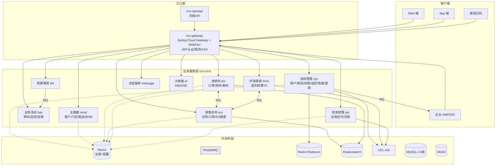
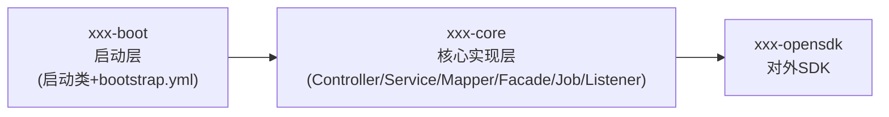

# 领益智造 · Java 高级工程师 / 架构师 面试应对文档

> **基于 CCS 渠道云项目（ccs-services）实战 + 领益智造业务调研**
> 文档目标：把"我正在开发运维的项目"讲深、讲透、讲出架构思考，并精准对接领益智造（002600）的制造业数字化场景。
> 用法建议：第一、二部分是"项目陈述脚本"（要背熟，能脱口而出）；第三部分是"高频问答库"（被追问时按要点回答）；第四、五部分是临场策略。
> ⚠️ 提示：文中的"我的角色 / 我负责的模块"请按你的真实情况调整——文档给出了几种典型表述模板，挑最贴近你实际工作的一种。

---

## 目录

- [第〇部分 核心叙事主线（务必先读）](#第〇部分-核心叙事主线务必先读)
- [第一部分 知己：CCS 项目陈述脚本](#第一部分-知己ccs-项目陈述脚本)
  - [1.1 项目一句话定位](#11-项目一句话定位)
  - [1.2 三段式自我介绍话术（30 秒 / 2 分钟 / 5 分钟）](#12-三段式自我介绍话术30-秒--2-分钟--5-分钟)
  - [1.3 项目全景：业务背景与技术栈](#13-项目全景业务背景与技术栈)
  - [1.4 系统架构图](#14-系统架构图)
  - [1.5 我的角色与职责（含模板）](#15-我的角色与职责含模板)
  - [1.6 八大核心技术亮点（面试弹药库）](#16-八大核心技术亮点面试弹药库)
  - [1.7 难点与解决方案（STAR 法则实战）](#17-难点与解决方案star-法则实战)
  - [1.8 性能与稳定性数据（按实际补全）](#18-性能与稳定性数据按实际补全)
- [第二部分 知彼：领益智造与制造业面试侧重点](#第二部分-知彼领益智造与制造业面试侧重点)
- [第三部分 高频面试问答库（结合项目）](#第三部分-高频面试问答库结合项目)
- [第四部分 反问环节（给面试官提问）](#第四部分-反问环节给面试官提问)
- [第五部分 面试当天 Checklist](#第五部分-面试当天-checklist)

---

## 第〇部分 核心叙事主线（务必先读）

整场面试，请用一条主线把所有回答串起来：

> **"我长期参与一个面向制造业的渠道分销云（SaaS）平台的研发与运维——CCS 渠道云。它服务的客户（如泉峰集团）是典型的离散制造业，平台要管理分销商、终端门店、进销存、销售合同、返利核算、财务结算这一整条渠道价值链。所以我对'制造业 + 复杂业务 + 多组织多账套 + 高一致性要求'这类场景有第一手的工程经验。领益智造作为全球消费电子精密件龙头、80 个生产基地、庞大的全球分销与供应链网络，正是这类系统的典型受益方，这也是我对这个岗位最感兴趣的原因。"**

为什么这条主线强：
1. **业务同构**：领益的痛点（多组织、多工厂、全球分销、渠道管控、业财一体）和 CCS 解决的问题高度重合，你不是"门外汉"。
2. **技术匹配**：Spring Cloud Alibaba 全家桶 + 多租户 + 数据权限 + 分布式 + 消息驱动，是制造业中台/SaaS 的主流选型。
3. **稀缺性**：多数 Java 候选人讲电商秒杀，你讲"制造业渠道域 + 返利核算 + 财务月结"，这是领益 IT 更关心的真实业务。

**总原则：先讲业务价值和架构权衡，再讲技术细节；每个技术点都落到"解决了什么业务问题"。**

---

## 第一部分 知己：CCS 项目陈述脚本

### 1.1 项目一句话定位

> CCS（Channel Cloud Service）渠道云产品服务，是一个**面向制造业/快消行业的渠道分销管理 SaaS 平台**，用 Spring Cloud Alibaba 微服务架构构建，共 10 个业务微服务 + 1 个网关 + 1 个开放 API 服务，覆盖"主数据 → 进销存 → 销售合同 → 市场返利 → 财务结算 → 消息/AI"全链路，支持多租户、多账套、行/列级数据权限。

### 1.2 三段式自我介绍话术（30 秒 / 2 分钟 / 5 分钟）

#### 🔹 30 秒版（电梯演讲，开场自我介绍用）

> 我有 X 年 Java 后端经验，目前在美云智数（美的集团旗下企业云服务商）参与 **CCS 渠道云**的研发与运维。这是一个面向制造业的渠道分销 SaaS，基于 Spring Boot 3 + Spring Cloud Alibaba 的 10+ 微服务架构，技术栈覆盖 Nacos、RocketMQ、Redis、Elasticsearch、XXL-Job 等。我主要负责 [XXX 模块，如：销售合同/返利核算/系统权限]，在其中落地了 [数据权限 AOP 拦截、分布式序列号、ES 订单搜索] 等核心能力。我对制造业复杂业务的中台化、多租户隔离、分布式一致性有比较深的实战积累。

#### 🔹 2 分钟版（面试官问"介绍一下你的项目"时用）

> 这个项目叫 CCS 渠道云，是给制造业客户做渠道分销管理的 SaaS 平台，客户包括泉峰集团这类离散制造企业。
>
> **业务上**，它管的是商品从厂家到消费者的整条渠道链：主数据（客户/分销商/门店/商品/BOM）、业务活动（拜访/巡检/促销）、进销存（订单/条码/库存）、销售合同与销售政策、市场返利（规则-申请-核算-核销-支付）、财务结算（应收应付/月结/配额）、预算费用，还有消息中心和 AI 智能问答。
>
> **技术上**，我们用 Spring Boot 3 + Spring Cloud Alibaba 做微服务拆分，一共 10 个业务服务加 1 个网关。注册配置中心用 Nacos，网关用 Spring Cloud Gateway（WebFlux 响应式），服务间用 OpenFeign，消息用 RocketMQ，搜索用 Elasticsearch，定时任务用 XXL-Job（我们做了注解化封装叫 xxl-job-lifecycle），缓存和分布式锁用 Redis/Redisson，数据库是 MySQL + Druid + 多数据源 + Flyway 管版本。
>
> **我重点参与的是 [XXX]**，其中比较有技术含量的几块：一是基于 AOP 的**数据权限拦截器**（@DataPermisson 注解），在 Service 方法执行前动态拼装 SQL 条件注入 MyBatis 的 QueryWrapper，实现行级数据权限；二是**分布式序列号生成**，用 Redisson 锁 + DB 号段模式生成业务单据号；三是 [返利核算的批量计算 / ES 与 MySQL 的数据同步]。
>
> 整个项目我比较深的体会是：制造业 SaaS 的难点不在并发量，而在于**业务规则复杂、多组织多账套的数据隔离、业财一致性和可追溯性**。

#### 🔹 5 分钟版（深入讲解时用，按"业务→架构→技术亮点→难点→收获"展开）

见下方 1.3 ~ 1.7 各节，串起来讲即可。

### 1.3 项目全景：业务背景与技术栈

**业务背景**
- 定位：渠道分销管理 SaaS（DMS / TPM / 经销商协同）
- 客户：制造业/快消企业（典型如泉峰集团——电动工具行业龙头）
- 核心域：主数据(mmd) → 业务活动(bas) → 进销存(psi) → 销售合同(vcs) → 市场营销/返利(mms) → 财务结算(ats) → 预算费用(bfs)，横向有系统管理(sys)、基础服务(base)、消息(message)、AI(ai)

**技术栈一览（这是你的"弹药清单"，每一项都要能讲）**

| 层次 | 技术选型 | 项目中的用途 |
|------|---------|------------|
| **应用框架** | Spring Boot 3.x + Spring Cloud (Alibaba) | 微服务基座（已升级到 Jakarta EE / Boot 3） |
| **服务治理** | Nacos | 注册中心 + 配置中心（动态配置、Sentinel 规则数据源） |
| **API 网关** | Spring Cloud Gateway + WebFlux | 统一入口、JWT 认证、XSS 防护、Sentinel 限流 |
| **服务间通信** | OpenFeign + Sentinel | 声明式调用 + 熔断降级；按服务拆分 ccs-remote-* 模块 |
| **认证授权** | Spring Security 6 + CAS + JWT(JJWT) + Redis | 多种登录方式 + 功能权限(@PreAuthorize) + 数据权限(@DataPermisson) |
| **ORM** | MyBatis-Plus + dynamic-datasource | 单表 CRUD + 多数据源动态切换 |
| **数据库** | MySQL 8 + Druid 连接池 + Flyway | 业务库 + SQL 版本管理 |
| **缓存** | Redis + Redisson + J2Cache | 缓存、分布式锁、分布式序列号、二级缓存 |
| **消息队列** | RocketMQ | 跨服务编排、异步解耦（账套初始化、费用核算、IAM 同步、操作日志） |
| **搜索** | Elasticsearch + IK 分词 | 销售商品/订单搜索（vcs）、销售分析（psi/mms） |
| **定时任务** | XXL-Job（自研 xxl-job-lifecycle 封装） | 月结、返利核算、ES 同步、IAM 同步等 |
| **对象存储** | MinIO（经 OSCA 封装） | 附件、合同文件 |
| **工作流** | MFlow SDK | 审批流 |
| **链路追踪** | SkyWalking（apm-toolkit-logback） | 全链路 traceId |
| **AI** | Dify 集成 + SSE 流式 | 智能问答（ccs-svc-ai） |
| **国密** | SM4 | 网关 header 透传加密 |

> 💡 讲技术栈时**不要背清单**，要讲"为什么选它"。例：为什么 RocketMQ 不是 Kafka？——RocketMQ 事务消息、定时/延迟消息、标签(tag)路由更适合业务编排场景；Kafka 更适合大数据流。为什么 Gateway 不是 Zuul？——Zuul1 是 Servlet 阻塞，Gateway 是 WebFlux 非阻塞，吞吐高。

### 1.4 系统架构图

#### 整体架构（可直接在白板画出）



#### 单个微服务内部分层（每个服务都遵循这套结构）



- **API 契约层**（ccs-api-*）：定义 Facade 接口 + DTO，被服务实现方和调用方共享
- **远程调用层**（ccs-remote-*）：Feign 客户端 + 拦截器（数据权限拦截器、字典翻译拦截器都在 remote-common）
- **服务实现层**（ccs-svc-*）：每个服务再分 boot / core / opensdk 三层
- **扩展层**（ccs-extensions）：客户/行业定制包（如 mmd 行业包）

> 💡 这套"API 契约与实现分离 + remote 独立"的设计是面试加分点，体现了"接口契约先行"的架构意识，便于多团队协作和版本管理。

### 1.5 我的角色与职责（含模板）

⚠️ **请按真实情况选择/修改以下模板**。诚实是第一位的，但要把"做过的事"讲到最深。

**模板 A（模块负责人 / 核心开发）**
> 我在项目中负责 [XX 服务，如 mms 返利核算 / vcs 销售合同 / sys 系统权限] 模块的设计与开发，独立完成了 [数据权限拦截器、返利批量计算 Job、ES 商品索引同步] 等核心功能，并参与 [迁云评估、产品加固、线上问题排查] 等运维工作。

**模板 B（全栈型 / 多模块参与）**
> 我参与了多个模块的迭代开发，包括 [mmd 主数据、psi 进销存、sys 权限]，同时负责公共能力的建设和维护，比如 [Feign 拦截器、统一异常处理、XXL-Job 注解封装、Flyway 脚本管理]。近期主要在做 [迁云调研（AWS→阿里云）+ 产品加固 + 性能优化]。

**模板 C（运维 + 二开型，贴合"开发运维"描述）**
> 我的角色偏"开发 + 运维 + 二开"。一方面做需求迭代（[举例 2-3 个需求]），另一方面负责线上稳定性和部署：包括 Nacos 配置治理、XXL-Job 任务治理、中间件使用规范梳理（我产出了项目中间件分析报告）、迁云技术调研等。

> 🔑 无论哪种，结尾都强调一句：**"所以我对这个项目从业务、架构到每个中间件的实际使用情况，都有第一手的掌握。"**（这是你区别于"只写过 CRUD"的候选人的关键）

### 1.6 八大核心技术亮点（面试弹药库）

> 每个亮点按 **「是什么 → 怎么实现(代码级) → 解决什么问题 → 可能被追问」** 组织。被问到相关话题时，主动把话题引到这些点上。

---

#### 🎯 亮点 1：网关统一认证与安全（Spring Cloud Gateway + JWT + Redis 白名单 + SM4）

**是什么**：所有外部请求经 ccs-gateway 统一处理认证、限流、安全防护，下游业务服务无需重复解析 token。

**怎么实现（代码级）**：
- 网关基于 **WebFlux 响应式**（非阻塞 I/O，适合网关这种 I/O 密集场景）
- `JWTTokenFilter` 实现 `GlobalFilter, Ordered`：
  1. 从请求头取 Bearer Token
  2. 用 JJWT + 密钥验签、解析 Claims（`JWTTokenFilter.java:130-140`）
  3. 用 tokenId 查 Redis 是否存在（**白名单机制**）——这让我们能"强制踢人下线"，纯 JWT 做不到
  4. 验证通过后，把 subject/tokenId 等用户信息用 **SM4 国密加密**塞进请求头，透传给下游（`JWTTokenFilter.java:63-104`）
- `XssFilter`：用装饰器模式(`ServerHttpRequestDecorator`)重写请求体，过滤 XSS，支持 Nacos 动态开关
- Sentinel 限流：规则放 Nacos（`ccs-gateway-sentinel.json`），动态加载；自定义 `BlockRequestHandler` 返回统一 JSON

**解决什么问题**：
- 认证逻辑收敛，业务服务零侵入
- Redis 白名单支持"主动失效"，弥补 JWT 无法主动过期的缺陷
- 国密算法满足合规（金融/政企客户要求）

**可能被追问**：
- Q：为什么不用 Zuul？→ Zuul1 基于 Servlet 阻塞模型，Gateway 基于 Netty + Reactor，非阻塞吞吐更高；且 Gateway 与 Spring Cloud 生态集成更好。
- Q：JWT 放 Redis 不就失去"无状态"优势了吗？→ 折中设计：token 本身仍是无状态可验签的（性能好），Redis 只做"白名单校验"这一个轻量查询；可以用 Redis 的 EXPIRE 自动过期，存储成本低。这是"无状态 + 可控"的平衡。
- Q：token 续签怎么做？→ 双 token（access + refresh）或滑动过期（每次访问刷新 Redis TTL）。

---

#### 🎯 亮点 2：功能权限 + 数据权限"双层权限模型"

这是**最能体现深度的点**，务必讲熟。

**背景**：制造业渠道系统里，"能看哪些菜单/按钮"（功能权限）和"能看哪些数据行"（数据权限，比如只能看自己负责区域的订单）是两个独立诉求。

**(A) 功能权限 —— @PreAuthorize + Spring Security 6 + SpEL**

```java
@PreAuthorize("@rbac.hasPermission('sysRole.saveMenuAuthRole')")
@PostMapping("/saveMenuAuthRole")
public BaseResponse saveMenuAuthRole(@RequestBody SysMenuAuthSaveReqDTO req) { ... }
```

- 原理：Spring Security 6 的 `@EnableMethodSecurity` 自动注册 `AuthorizationManagerBeforeMethodInterceptor`，对带 `@PreAuthorize` 的方法生成 CGLIB 代理（Spring Boot 3 默认 CGLIB）
- SpEL 表达式 `@rbac.hasPermission('xxx')` 中的 `@rbac` 通过 `BeanResolver` 从容器拿到名为 `rbac` 的 Bean，调用其 `hasPermission()`，返回 boolean 决定是否放行
- 用户权限在登录时由 `PermissionUtil.setRoleAndPermissions()` 一次性加载（菜单 URL + 权限标识 perms）存入用户上下文/Redis

**(B) 数据权限 —— @DataPermisson + AOP 拦截器（这是项目自研的硬核设计）**

```java
@DataPermisson(
    dataPermissionTypes = {LinePermDataType.ORG, LinePermDataType.COMPANY, LinePermDataType.CHANNEL},
    tableFieldNames = {"a.org_id", "a.company_code", "a.channel_code"},
    fieldTypes = {PermFieldType.ID, PermFieldType.CODE, PermFieldType.CODE},
    isIncludeChilds = true
)
public List<SaleRelateApResponseDTO> queryCustPermissonList(SaleRelateApSearchDTO request) { ... }
```

- `DataPermissionInterceptor`（位于 `ccs-remote-common`，AOP `@Before`）：
  1. 反射读取方法上的 `@DataPermisson` 注解
  2. 从 `ServiceUserInfoUtil.getUserInfo()` 拿当前用户（ThreadLocal 上下文）
  3. 调用 `sysPermissionUtil.getDataPermission(...)` 查该用户在 [组织/公司/渠道] 维度的授权范围（如可见的 orgId 列表）
  4. 拼装 `Condition`（如 `a.org_id IN (1001,1002) OR a.org_id IS NULL`），塞进请求参数的 `conditionList`
  5. MyBatis XML 里 `${ew.sqlSegment}` 把条件拼到 WHERE，最终只查出有权限的数据
- **关键认知**（这是你研究过的，可主动讲）：数据权限拦截器**只改 WHERE 条件、不改返回字段**；返回结果里的 orgId 是数据库字段本身就有的，不是 AOP 注入的。

**解决什么问题**：
- 业务代码零侵入（一个注解搞定），新增数据维度只改注解参数
- "拼条件"而不是"查出来再过滤"，性能好（走索引）
- 支持多维度组合（组织 AND 公司 AND 渠道）和"包含子级"递归

**可能被追问**：
- Q：AOP 用的是 JDK 代理还是 CGLIB？→ Spring Boot 3 默认 CGLIB（`proxyTargetClass=true`），即使有接口也用 CGLIB 生成子类。
- Q：自调用时 @PreAuthorize / AOP 为什么不生效？→ AOP 基于代理，`this.xxx()` 不走代理对象。解决：`AopContext.currentProxy()`、注入自身、或用 AspectJ 编译时织入。
- Q：数据权限的"包含子级 isIncludeChilds"怎么实现？→ 递归查询组织树的子孙节点（一般组织表有 parent_id，用递归 CTE 或先全量加载到内存构建树）。

---

#### 🎯 亮点 3：多租户 + 多账套隔离（tenantId + setsOfBooksId）

**背景**：SaaS 平台要服务多个客户（租户），同一个客户内部还有多套账（如不同事业部、不同法人主体）。

**实现**：
- 双重隔离维度：`tenantId`（租户）+ `setsOfBooksId`（账套）
- 用户登录后，上下文（`UserInfo`，ThreadLocal）里携带这两个 ID
- 跨服务调用时通过 header 透传（网关已注入）
- 业务查询自动带上租户/账套条件，例：
  ```java
  // SysCodeRuleService.java:92
  this.getOne(Wrappers.<SysCodeRule>lambdaQuery()
      .eq(SysCodeRule::getTenantId, request.getTenantId())
      .eq(SysCodeRule::getSetsOfBooksId, request.getSetsOfBooksId())
      .eq(SysCodeRule::getIsDel, False));
  ```
- 数据库表设计上每张业务表都有 `tenant_id` + `sets_of_books_id` 字段

**解决什么问题**：
- 一套代码服务多客户，数据物理隔离（逻辑隔离 + 强制条件）
- 账套级配置（编码规则、权限、组织）独立

**可能被追问**：
- Q：租户隔离用"共享库+字段"还是"独立库"？→ 我们是共享库 + tenant_id 字段逻辑隔离（成本低、运维简单），对数据量极大的表可考虑按租户分库。
- Q：怎么保证每条查询都带 tenant_id，不会漏？→ MyBatis-Plus 可以用 TenantLineInnerInterceptor 自动拼接；或代码 review 规范 + SQL 审计。
- Q：ThreadLocal 在异步线程/线程池下会丢失怎么办？→ 用 `TransmittableThreadLocal`(TTL) 或在提交线程池任务时手动传递上下文。

---

#### 🎯 亮点 4：分布式序列号生成（Redisson 锁 + DB 号段）

**背景**：业务单据号（订单号、合同号、返利单号）要全局唯一、可读、可追溯，还要支持规则配置（前缀+日期+流水号等）。

**实现（`SysCodeRuleService.java`）**：
- 编码规则存表 `sys_code_rule`（前缀、日期格式、流水位数、是否补零等）
- 流水号生成用 **Redisson 分布式锁**保证集群下并发安全：
  ```java
  RLock lock = redissonManager.getRedisson()
      .getLock("locks:" + SysCodeRule.class.getName() + "::" + ruleId);
  lock.lock(-1, TimeUnit.MINUTES);  // -1 = 自动续期（看门狗）
  try { /* 取号、更新流水 */ } finally { lock.unlock(); }
  ```
- 可优化为**号段模式**（segment）：每次从 DB 取一个号段（如 1~1000）缓存到内存，用完再取，减少锁竞争和 DB 访问（类似 Leaf/美团分布式 ID）

**解决什么问题**：
- 集群环境下并发取号不重复、不空洞
- 业务可配置规则，前端友好（如 `SO202607060001`）

**可能被追问**：
- Q：为什么不用 UUID / 雪花算法？→ UUID 无序（B+ 树插入碎片）、不可读；雪花算法依赖时钟、机器位分配复杂，且单据号业务上需要带规则（前缀/日期）。Redisson+号段更适合"有业务含义"的单据号。
- Q：Redisson 锁的原理？→ 基于 Redis 的 Lua 脚本实现加锁/解锁；支持可重入（Hash 结构存线程标识+重入次数）、看门狗自动续期（默认 10s 续 30s）、公平锁/读写锁。
- Q：锁挂了怎么办（Redis 主从切换丢锁）？→ Redisson 的 RedLock 算法（多节点加锁，多数成功才算成功），但争议较大（Martin Kleppmann vs antirez 著名论战）；生产上更常用"主从+哨兵+锁超时兜底+业务幂等"。

---

#### 🎯 亮点 5：消息驱动的跨服务编排（RocketMQ）

**背景**：账套初始化、费用核算、IAM 同步等跨服务流程，不能同步调用（耦合 + 阻塞 + 失败连锁）。

**实现**：典型的几个消息流向（来自项目的实际 Topic）：
- **mmd → psi**：账套初始化 `InitDateReq`，psi 消费 `PsiInitSetsOfBookIdMessageListener` 完成进销存域初始化
- **bfs → bas**：费用核算 `ACTIVITY_APPLY_TOPIC`，bas 消费 `CalculatedMessageListener`
- **psi → psi（自消费）**：`InvInBillPrice`、`InvOutBillSales` 等价格/销售流水异步处理
- **sys → IAM**：组织/账号同步 `sendRoleToIam`
- **message 自消费**：`NotifyMqMessageListener` 收消息后通过 MC-SDK 推送站内/外通知

**解决什么问题**：
- 服务解耦、异步削峰
- 跨域数据最终一致（配合幂等消费）

**可能被追问**（⭐ 消息队列是高频深问区，必须准备好）：
- Q：怎么保证消息不丢？→ 生产者用同步发送 + 失败重试；Broker 开启同步刷盘 + 主从复制；消费者手动 ACK（消费成功才确认）。
- Q：怎么保证不重复消费（幂等）？→ 消费端做幂等：业务唯一键（单据号+操作）去重表、Redis SETNX、状态机校验（如订单已支付就忽略）。
- Q：怎么保证消息顺序？→ 同 key（如同一订单）发到同一 queue，单线程消费；RocketMQ 用 MessageQueueSelector。
- Q：消息积压怎么办？→ 临时扩消费者（注意消费者数 ≤ queue 数）、消费端批量处理、跳过堆积消费后续补偿。
- Q：为什么 RocketMQ 不是 Kafka？→ RocketMQ 事务消息、Tag 过滤、定时消息、更友好的业务语义；Kafka 吞吐更高但业务编排能力弱。

---

#### 🎯 亮点 6：Elasticsearch 搜索 + MySQL 数据同步

**背景**：销售商品/订单要支持多维度组合搜索（名称、规格、客户、价格、区域、品牌），MySQL LIKE 性能差。

**实现（vcs 模块 `EsItemService` / `EsItem`）**：
- 实体标注 `@Document(indexName="esitem")`、`@Setting(shards=1, replicas=1)`
- 字段精细化映射：`@Field(type=FieldType.Keyword)` 用于精确匹配/聚合；`@Field(type=FieldType.Text, analyzer="ik_max_word", searchAnalyzer="ik_smart")` 用于中文全文检索
- **双写与同步**：
  - 定时任务全量同步：`EsItemJob`（`@XxlJobExpose`）每天凌晨 `0 0 0 * * ?` 全量重建
  - MQ 增量同步：业务变更发 `EsItemInitReqDTO` 消息，`EsItemInitMessageListener` 消费后增量更新
- 分布式锁防并发：`@DistributedLock(lockKey="esItemInit", timeout=600000)`

**解决什么问题**：复杂搜索从 MySQL 卸载到 ES，保护主库；中文分词支持模糊搜索。

**可能被追问**：
- Q：ES 和 MySQL 数据一致性怎么保证？→ 这是经典难题。我们的策略：双写（先 DB 后 ES）+ MQ 重试兜底 + 定时全量校对（compensation）。更严格可用 Canal 监听 binlog 异步同步（CDC），让 DB 是唯一写入源。强一致场景读时回查 DB。
- Q：为什么不全用 ES 不用 MySQL？→ ES 不支持事务、写性能弱、不适合关系建模、字段类型固化难变更。MySQL 是事务与关系数据的主，ES 是搜索与分析的辅。
- Q：ES 深度分页问题？→ `from + size` 超过 1万条性能差（coordinator 要排序），用 `search_after`（基于排序值游标）或 scroll。

---

#### 🎯 亮点 7：大批量计算（返利核算 RebateCalcJob）

**背景**：市场返利核算要按政策规则，对海量订单逐条计算返利金额，月末批量执行，单次可能几十万到百万级数据。

**实现（`RebateCalcJob.java`）**：
- XXL-Job 定时触发（cron 配置在 Nacos，可动态调整）
- **分页处理防 OOM**：每页 30 条，循环查询 `state=DRAFT AND calState=NOT_START` 的待算单据
- **状态机控制**：`NOT_START → RUNNING → COMPLETED/FAILED`，防止重复计算
- 每条单据独立 try-catch，单条失败不影响整体（异常隔离）
- 分布式锁 + 幂等保护（`RebateCalcExecutorService`）

**解决什么问题**：大数据量不 OOM、可断点续算、可重跑、异常不扩散。

**可能被追问**：
- Q：为什么不用多线程并行加速？→ 可以加，但要考虑 DB 连接池压力、行锁竞争；更优是"分片"——XXL-Job 支持分片广播，多个执行器节点各处理一部分数据（按 id % shardTotal 分片）。
- Q：百万级数据怎么优化？→ ①分片并行 ②批次大小调优 ③减少单条 DB 交互（批量 update）④热点数据缓存 ⑤业务低峰执行。

---

#### 🎯 亮点 8：AI 模块（Dify 集成 + SSE 流式对话）

**背景**：渠道业务方希望有智能问答助手，能基于业务数据回答问题。

**实现（ccs-svc-ai / `ChatStreamController`）**：
- 用 **WebFlux + SSE（Server-Sent Events）** 实现流式输出：
  ```java
  @PostMapping(value="/chat", produces=MediaType.TEXT_EVENT_STREAM_VALUE)
  public Flux<ServerSentEvent<ChatResponse>> chat(@RequestBody ChatRequest req) {
      return chatStreamService.chat(req)
          .map(sb -> ServerSentEvent.builder(sb).build());
  }
  ```
- 集成 **Dify**（开源 LLM 应用平台）作为 AI 编排层（Prompt、知识库、Function Calling）
- 支持用户主动中断对话（abort）、异步事件保存聊天记录

**解决什么问题**：交互体验好（打字机效果）、可控、可与业务知识库结合（RAG）。

**可能被追问**：
- Q：为什么用 SSE 不用 WebSocket？→ SSE 单向（服务端推）、基于 HTTP、简单、自动重连、更适合"AI 流式输出"这种场景；WebSocket 双向但复杂，适合聊天室。
- Q：流式输出底层原理？→ WebFlux 基于 Reactor，`Flux` 是数据流，每个 token 生成后立即 push 给客户端，不用等整句生成完，降低首字延迟。
- Q：怎么防止 AI 幻觉/接业务数据？→ RAG（检索增强生成）：先把业务数据向量化存向量库，用户提问时先检索相关业务上下文，再喂给 LLM 生成。

---

### 1.7 难点与解决方案（STAR 法则实战）

> 面试官最爱问"遇到过什么难点"。准备 2-3 个真实故事，按 **S(场景)-T(任务)-A(行动)-R(结果)** 讲。

**故事 1：数据权限拦截器的"orgId 来源之谜"（排查类，体现深度）**
- **S**：在排查销售关系查询时发现，调用 `queryCustPermissonList` 时入参 DTO **没有设置 orgId**，但后续代码却能从结果里取到 orgId 去远程查组织名称。
- **T**：搞清楚 orgId 到底从哪来，确认数据权限拦截器是否正确工作。
- **A**：顺着调用链读源码，发现关键认知——`@DataPermisson` 拦截器**只往 SQL 的 WHERE 注入了权限条件**（`a.org_id IN (...)`），并不给 DTO 赋值；返回结果里的 orgId 来自**数据库表本身的 org_id 字段**经 MyBatis 映射。之前误以为是 AOP 往参数里注入 orgId。
- **R**：纠正了团队对这个机制的理解误区，并产出了一份分析文档，避免后续基于错误认知改代码引入 bug。
- **可升华的点**：讲完后说"这件事让我意识到，读源码不能只看调用链表面，要理解 AOP 在哪一层、改的是什么对象"。

**故事 2：迁云调研（架构 + 工程类，体现全局观）**
- **S**：项目要从 AWS 整体迁移到阿里云，需要评估改造量和风险。
- **T**：梳理技术栈、识别需要改代码的点、制定迁移方案。
- **A**：从代码（pom.xml + 源码）+ Nacos 配置双重交叉验证，逐服务盘点了 11 个服务的中间件使用情况，输出矩阵；识别出唯一需改代码的是对象存储（S3→OSS），并给出三种方案（SDK 适配 / OSS S3 兼容模式 / 逐模块改），推荐方案 B（改配置即可）；数据库用 DTS 全量+增量、Redis 用 redis-shake、割接窗口选月末外低峰期。
- **R**：产出了迁云应答指南，把"需要改代码"的范围从"未知"收窄到"对象存储一处"，大幅降低了迁云风险评估的不确定性。
- **可升华的点**："通过这次调研，我对整个项目从代码到中间件到部署架构有了全局认知，这也是架构师必备的'全局视野'。"

**故事 3（按你真实经历补一个，下面给框架）**
- **S**：[某次线上问题 / 性能瓶颈 / 复杂需求]
- **T**：[你的目标]
- **A**：[你怎么定位、怎么设计、怎么实现]
- **R**：[量化结果：QPS 提升 X% / 响应时间从 X 降到 Y / 0 故障]
- 候选素材：① 某个慢 SQL 优化（加索引/改写/分页）② 线上 OOM/CPU 飙高排查（jstack/jmap/MAT）③ 一个复杂业务规则的设计（返利计算规则引擎）④ 死锁排查 ⑤ 缓存击穿/雪崩处理

### 1.8 性能与稳定性数据（按实际补全）

⚠️ 数字务必真实，没有精确值就给"量级"或"我们的体感"。下面是框架，填你的：

- 服务规模：10 个微服务 + 1 网关 + 1 OpenAPI
- 数据库：每个服务独立库（约 10+ 个 MySQL 库）
- 日均请求量：约 [X] 万/QPS 峰值约 [X]
- 业务数据量：核心表 [X] 千万级 / [X] 亿级
- 典型高峰：月末财务月结、返利核算日、促销期
- 可用性目标：[99.9% / 99.95%]
- 典型 RT：接口 P99 < [X]ms

> 如果记不清具体数字，可以这样答："具体 QPS 数字我现在记不精确，但我们的量级是 [中型 SaaS，日活几万到十几万经销商]，峰值在月末结算和促销期。"

---

## 第二部分 知彼：领益智造与制造业面试侧重点

### 2.1 领益智造速览（面试前必背）

| 维度 | 内容 |
|------|------|
| **全称** | 广东领益智造股份有限公司（Lingyi iTech (Guangdong) Company） |
| **股票代码** | 002600.SZ（深交所），2018 年借壳江粉磁材上市 |
| **总部** | 广东江门；研发/制造基地遍布深圳、东莞、苏州、成都、郑州、扬州等 |
| **行业地位** | 全球消费电子精密功能件供应商 **NO.1**（市场份额与出货量连续多年全球领先） |
| **核心客户** | 苹果产业链核心供应商，覆盖智能手机、AIPC、AR/VR、AI 服务器等 AI 终端硬件 |
| **营收规模** | 2023 年营收约 **341 亿元**，市值曾超千亿；2024Q1 营收 98 亿（+35.8%） |
| **人员** | 员工 10 万+，研发人员约 6000 人，累计专利 2000+ |
| **全球布局** | **80 个**生产基地及交付中心：中国、越南、印度、泰国、美国、巴西、芬兰等 |
| **业务拓展** | 精密功能件/结构件/模组 → 新能源汽车、光伏储能、机器人、AI 服务器、低空经济 |
| **数字化** | 大型离散制造企业，SAP ERP + MES + WMS + SRM + CRM 体系；持续数字化转型 |

### 2.2 业务结合点（把 CCS 与领益连起来——你的核心差异化）

面试中要**主动建立连接**，让面试官觉得"这个人懂我们的业务"。可这样表达：

> "我研究过领益的业务——全球消费电子精密件龙头、苹果链核心供应商、80 个生产基地遍布全球。这类企业的 IT 痛点我很熟悉，因为我的 CCS 项目就是服务制造业客户的：
>
> 1. **多组织/多法人/多工厂**：领益全球 80 个基地，必然有集团多组织架构——CCS 的多租户 + 多账套（tenantId + setsOfBooksId）正是为这种场景设计的，每个事业部/法人可独立账套又统一管控。
> 2. **庞大的渠道与供应链协同**：领益面向全球品牌商（如苹果），订单、合同、交付、对账链路长——CCS 的销售合同(vcs)、进销存(psi)、财务结算(ats)、返利核算(mms) 正好覆盖这条链。
> 3. **业财一体化**：制造业对成本和财务准确性要求极高——CCS 的财务月结、应收应付、配额控制，要保证跨服务数据一致性，我们用 RocketMQ + 幂等 + 状态机 + 对账补偿来兜底。
> 4. **数据权限与合规**：跨国制造要求数据分域分权管控——CCS 的行级数据权限拦截器（按组织/公司/渠道）正是这个能力。
>
> 所以如果有机会加入领益的 IT 团队，我相信我的渠道域/供应链域 SaaS 经验能很快落地。"

### 2.3 制造业 IT 面试官的关注点（与互联网公司不同！）

制造业（尤其领益这种）的 Java 架构师面试，**侧重点和互联网大厂不同**，要调整预期：

| 关注点 | 制造业（领益）更看重 | 互联网大厂更看重 |
|--------|---------------------|-----------------|
| **业务复杂度** | ⭐⭐⭐⭐⭐ 多组织、多账套、业财一致、可追溯 | ⭐⭐⭐ 业务相对简单 |
| **并发量** | ⭐⭐⭐ 内部系统为主，量级中等 | ⭐⭐⭐⭐⭐ 极高并发（秒杀） |
| **数据一致性** | ⭐⭐⭐⭐⭐ 财务、库存不能错 | ⭐⭐⭐⭐ 最终一致为主 |
| **系统集成** | ⭐⭐⭐⭐⭐ 与 SAP/CRM/MES/WMS 集成是日常 | ⭐⭐⭐ 内部系统为主 |
| **稳定性/可运维** | ⭐⭐⭐⭐⭐ 7×24 生产不能停 | ⭐⭐⭐⭐ |
| **技术新潮度** | ⭐⭐⭐ 务实为主 | ⭐⭐⭐⭐⭐ 追求新技术 |
| **架构能力** | ⭐⭐⭐⭐ 中台/领域建模 | ⭐⭐⭐⭐⭐ 海量高可用 |

**对策**：
1. **少讲秒杀/超高并发**（除非你真有），**多讲业务建模、领域划分、数据一致性、系统集成、稳定性**。
2. 主动问他们的技术栈（SAP 集成？低代码？自研中台？），表现出"我想了解你们真实场景"的姿态。
3. 如果他们用 SAP/ABAP，可以说："我虽然主攻 Java，但对 ERP/MES 这类制造业核心系统的业务概念（BOM、工单、MRP、应收应付）有理解，集成起来不难。"

### 2.4 关于"领益可能的技术栈"的提醒

领益作为大型制造集团，IT 体系可能包括：
- **核心 ERP**：大概率是 SAP（制造业龙头标配）
- **MES/WMS/SRM/CRM**：自研或采购（鼎捷/用友/赛意等厂商方案）
- **自研中台/业务系统**：Java 技术栈（这就是招 Java 架构师的原因）
- **可能涉及**：低代码平台、工业互联网平台、数据中台、AI 质检

**建议你在面试一开始（或反问环节）打听清楚**：他们招这个岗位是做哪块系统？是自研业务中台？集成平台？还是某个具体业务域？这决定了你重点讲哪部分经验。

---

## 第三部分 高频面试问答库（结合项目）

> 下面每个问题都给"参考答案要点"，回答时结合 CCS 项目举例，会更有说服力。带 ⭐ 的是高频中的高频。

### 3.1 项目与系统设计类

**Q1（⭐）请详细介绍一下你的项目。**
→ 用 1.2 的 2 分钟版，再按面试官兴趣点展开。

**Q2（⭐）你在项目中遇到的最大挑战是什么？怎么解决的？**
→ 用 1.7 的 STAR 故事（建议讲"数据权限拦截器排查"或"迁云调研"，体现深度和全局观）。

**Q3（⭐）如果让你重新设计这个系统，你会怎么改进？**
这个问题极好得分，体现反思能力。参考答：
> 1. **分布式事务**：我们现在 Seata 是配置了但实际没在业务代码里用 `@GlobalTransactional`（这点我可以诚实讲），主要靠 MQ + 幂等 + 对账保证最终一致。如果重做，对强一致的核心链路（如财务过账）会明确引入 Seata AT 或 TCC，其余保持最终一致。
> 2. **多租户隔离**：现在是字段级逻辑隔离，未来若某租户数据量极大，可演进为按租户分库（ShardingSphere）。
> 3. **服务划分**：个别服务边界还可以再收，比如 [可举例]。
> 4. **可观测性**：除了 SkyWalking，可以补 Prometheus + Grafana 做指标告警，ELK 做日志聚合。
> 5. **测试**：核心链路补集成测试和压测自动化。

**Q4 你们微服务是怎么划分边界的？依据是什么？**
→ 按**业务域（DDD）**划分：主数据域(mmd)、进销存域(psi)、合同域(vcs)、财务域(ats)等。依据：高内聚低耦合 + 团队组织结构（康威定律）+ 数据所有权（每个域拥有自己的库）。跨域通信用 Feign（同步查询）+ RocketMQ（异步编排）。

**Q5 服务间通信为什么混用 Feign 和 MQ？怎么选？**
- 同步、需要立即结果、低延迟 → Feign（如查主数据）
- 异步、解耦、削峰、跨域编排 → MQ（如账套初始化、费用核算、日志）
- 原则：能异步就异步，减少同步阻塞和强耦合。

### 3.2 Java 基础 / JVM / 并发

**Q6（⭐）JVM 内存结构？GC 算法和收集器？**
- 内存：堆（新生代 Eden+S0+S1 / 老年代）、方法区(Metaspace)、虚拟机栈、本地方法栈、程序计数器
- GC 算法：标记-清除（碎片）、标记-整理（无碎片但慢）、复制（新生代用）、分代收集
- 收集器：CMS（低延迟但已逐步弃用）、**G1**（大堆主流，Region 化，可预测停顿）、ZGC/Shenandoah（超低延迟）
- 实战答："我们生产用 G1，因为堆较大、对 STW 敏感。调过 `-XX:MaxGCPauseMillis` 和 `-XX:G1HeapRegionSize`。"

**Q7（⭐）线上 CPU 飙高/OOM 怎么排查？**
- CPU 高：`top` 找进程 → `top -Hp` 找线程 → `jstack <pid>` 看该线程在干嘛（通常是死循环/频繁 GC/锁竞争）
- OOM：`jmap -dump:format=b,file=heap.bin <pid>` dump 堆 → MAT 分析大对象/内存泄漏 → 看是哪个对象占满
- 结合项目："我们遇到过 [X] 场景，定位是 [Y]，通过 [Z] 解决。"

**Q8（⭐）synchronized 和 ReentrantLock 区别？AQS 原理？**
- synchronized：JVM 层、自动释放、锁升级（偏向→轻量→重量）；ReentrantLock：JDK 层(AQS)、手动 unlock、支持公平/可中断/超时/多条件变量
- AQS：用 volatile int state 表示同步状态 + CLH FIFO 双向队列 + CAS；独占/共享两种模式；ReentrantLock、Semaphore、CountDownLatch 都基于它

**Q9 线程池核心参数？怎么合理配置？**
- 7 参数：corePoolSize、maximumPoolSize、keepAliveTime、unit、workQueue、threadFactory、handler(拒绝策略)
- 配置：CPU 密集型 → 核心数+1；IO 密集型 → 核心数×2 或 N×(1+等待/计算)；队列别用无界 LinkedBlockingQueue（OOM 风险）
- 项目结合："我们返利核算/ES 同步会用线程池，注意了队列容量和拒绝策略。"

**Q10 volatile 和 happens-before？ThreadLocal 内存泄漏？**
- volatile：可见性 + 禁止指令重排，不保证原子性
- ThreadLocal：每个线程独立副本；用完必须 `remove()`，否则线程池复用线程会导致值串号 + Entry 的 value 强引用导致泄漏（弱引用 key + 强引用 value）

### 3.3 MySQL / Redis

**Q11（⭐）MySQL 索引为什么用 B+ 树？索引失效场景？**
- B+ 树：非叶子不存数据→扇出大→树矮（3 层索引千万级）；叶子有序链表→范围查询快
- 失效：函数操作列、隐式类型转换、最左前缀不满足、`LIKE '%xx'` 前导%、`OR`、`!=`/`NOT IN`

**Q12（⭐）事务隔离级别？MVCC 原理？ RR 下一定不幻读吗？**
- 四级：读未提交、读已提交、**可重复读(RR，MySQL 默认)**、串行化
- MVCC：每行有隐藏版本字段 + undo log 版本链 + 读视图(ReadView)，快照读不加锁
- RR 下**快照读**不幻读，但**当前读**(for update/lock in share mode)仍会幻读，靠**间隙锁(Gap Lock)/临键锁(Next-Key Lock)** 解决

**Q13（⭐）Redis 为什么快？常用数据结构？**
- 快：内存、单线程(避免锁/切换)、IO 多路复用(epoll)、高效数据结构
- 五种基础：String/List/Hash/Set/ZSet；高级：HyperLogLog、Bitmap、GeoHash、Stream

**Q14（⭐）缓存三大问题（穿透/击穿/雪崩）？**
- 穿透（查不存在的）：布隆过滤器 / 缓存空值
- 击穿（热 key 过期）：互斥锁 / 逻辑过期（不设 TTL，后台异步刷新）
- 雪崩（大量 key 同时过期）：TTL 加随机扰动 / 多级缓存 / 限流降级

**Q15（⭐）缓存与数据库一致性？**
- 方案：**先更 DB 再删缓存**(Cache Aside) + 延迟双删 + 消息队列重试兜底
- 为什么不先删缓存再更 DB？→ 删缓存后、更 DB 前，另一个请求把旧值写回缓存
- 强一致：用 Canal 监听 binlog 异步刷缓存，或加分布式读写锁（代价大）
- 项目结合："我们的 ES 同步就是这个思路——先写 MySQL，再发 MQ 异步刷 ES，定时全量校对。"

**Q16 Redis 分布式锁怎么做？需要注意什么？**
- SETNX + 过期时间（原子：`SET key val NX EX 30`）
- 问题：业务超时→锁自动释放→别人拿到锁→自己解锁解了别人的 → 用**UUID 标识 + Lua 脚本解锁**
- 自动续期：Redisson 看门狗（watchdog）
- 项目结合："SysCodeRuleService 用 Redisson 锁生成单据号；EsItemService 用 @DistributedLock 注解。"

### 3.4 Spring / 微服务

**Q17（⭐）Spring Bean 生命周期？循环依赖怎么解决？**
- 生命周期：实例化→属性注入→初始化(beanPostProcessor前后)→使用→销毁
- 三级缓存解决单例 setter 注入循环依赖（singletonObjects / earlySingletonObjects / singletonFactories）
- 构造器循环依赖无法解决（会报错），可用 @Lazy

**Q18（⭐）Spring AOP 原理？@Transactional 失效场景？**
- AOP：JDK 动态代理(接口) / CGLIB(子类)；Spring Boot 3 默认 CGLIB
- @Transactional 失效：方法非 public、自调用（this 不走代理）、异常被 catch 不抛出、rollbackFor 未配置（默认只回滚 RuntimeException）、传播行为配错、类没被代理（final/静态）

**Q19 Spring Boot 自动配置原理？**
- `@SpringBootApplication` → `@EnableAutoConfiguration` → `AutoConfiguration.imports`（Boot 3）/ `spring.factories`（Boot 2）→ 加载自动配置类 → `@Conditional*` 条件装配
- 项目结合："我们项目里 ccs-common-* 就是这么做的，定义 spring.factories 自动装配公共 Bean。"

**Q20（⭐）Nacos 既能做注册又能做配置，AP 还是 CP？**
- Nacos 默认 AP（临时实例，心跳，Distro 协议）；可切 CP（持久实例，Raft）
- 对比：Eureka(AP)、Zookeeper(CP)、Consul(CP)
- 服务发现一般选 AP（可用性优先，注册中心挂了本地还有缓存列表）

**Q21（⭐）Sentinel 和 Hystrix 区别？限流算法？**
- Sentinel：滑动窗口、流控/熔断/热点/系统自适应、控制台动态推规则；Hystrix：已停更，隔离舱模式
- 限流算法：计数器（固定窗口，临界问题）、滑动窗口、漏桶（匀速）、令牌桶（允许突发）

### 3.5 分布式

**Q22（⭐）分布式事务方案？你们怎么做的？**
- 2PC/XA：强一致但阻塞、性能差
- TCC：Try-Confirm-Cancel，业务侵入大，适合资金
- Saga：长事务拆子事务 + 补偿，适合长链路
- **本地消息表 / MQ 事务消息**：最终一致，最常用
- AT（Seata 默认）：代理 SQL 自动回滚
- **诚实答**："我们项目 Seata 配置了但业务代码实际没用 @GlobalTransactional，主要靠 RocketMQ + 本地消息表 + 幂等 + 对账保证最终一致。因为渠道域业务对一致性要求是'最终一致+可追溯'，强一致代价太大。如果做财务过账这类核心链路，我会评估引入 Seata AT。"

**Q23（⭐）CAP 和 BASE？**
- CAP：一致性/可用性/分区容错 三选二；分布式必有 P，故在 C 和 A 间权衡
- BASE：Basically Available(基本可用) + Soft state(软状态) + Eventually consistent(最终一致)，是 AP 的实践

**Q24 分布式 ID 方案？**
- UUID、雪花(Snowflake)、号段(Leaf)、Redis INCR、数据库自增步长、美团 Leaf、百度 UidGenerator
- 项目结合：见亮点 4（Redisson + 号段）

### 3.6 场景设计题（制造业高频）

**Q25（⭐）设计一个订单状态机，怎么保证状态流转正确？**
- 状态机：定义合法状态 + 合法流转（如 待支付→已支付→已发货→已完成，禁止跳跃）
- 实现：状态字段 + 流转校验（before/after 映射表）+ 乐观锁（version/version+状态双重条件 update）防并发
- 配合 MQ 异步通知下游 + 幂等

**Q26 设计一个返利核算系统，月末要算百万订单，怎么做？**
- 见亮点 7：分页/分片 + 状态机 + 异常隔离 + 分布式锁防重 + 低峰执行 + XXL-Job 分片广播
- 进一步：规则引擎（Drools/自研）配置化、热点数据缓存、批量 SQL

**Q27 怎么和 SAP ERP 做数据同步/集成？**
- 同步：RFC/BAPI（SAP 原生）/ REST（SAP 出 OData）/ 中间表
- 异步：SAP 发 IDoc → 中间件 → 我们消费；或我们监听 SAP 的 CDC
- 关键：幂等（单据号对账）、字段映射、异常重试、对账补偿
- 诚实："我项目里和外部 IAM 系统的同步就是这个模式（sys 服务用 MQ 同步组织/账号到 IAM），原理可迁移到 SAP 集成。"

**Q28 系统上线后发现某个接口慢，怎么优化？**
- 全链路：前端→网关→应用→DB→下游，逐段定位
- DB：慢 SQL（explain 看执行计划）、加索引、改写、分页
- 应用：减少循环查 DB（批量/缓存）、异步化、并行化
- 缓存：热点数据 Redis
- 压测：JMeter/Wrk 找瓶颈

---

## 第四部分 反问环节（给面试官提问）

> 反问质量直接影响"是否有思考"的印象。准备 3-5 个，挑 2 个问。

**技术向（推荐）**
1. "领益目前的 IT 系统架构大概是什么样的？Java 团队主要负责哪几块系统（自研中台 / 集成平台 / 业务域）？"
2. "这个岗位进来后，前 3-6 个月主要会负责什么？团队目前最大的技术挑战是什么？"
3. "你们的技术栈是 Spring Cloud 体系吗？有用 SAP / 低代码 / 自研框架吗？"
4. "团队对架构规范、代码质量、可观测性这块是怎么管理的？有 Code Review / 压测 / 监控体系吗？"

**业务向（体现你想融入）**
5. "领益的数字化转型目前到了哪个阶段？IT 团队在集团里是支撑角色还是有自研产品输出？"
6. "这个系统服务的用户主要是集团内部，还是会对外（如经销商/供应商协同）？"

**避免问**：薪资（留给 HR 面）、加班（显得计较）、"我表现怎么样"（让面试官尴尬）。

---

## 第五部分 面试当天 Checklist

**前一天**
- [ ] 背熟 1.2 的自我介绍（2 分钟版）
- [ ] 复习 1.6 的 8 个技术亮点，每个能讲 1-2 分钟
- [ ] 准备 2-3 个 STAR 难点故事
- [ ] 过一遍第三部分高频题（标⭐的必会）
- [ ] 背熟领益速览（2.1）

**当天**
- [ ] 提前 10 分钟到场/上线
- [ ] 开场主动建立连接："我研究过领益的业务，全球精密件龙头……我的渠道云项目正好服务制造业……"（见 2.2）
- [ ] 回答结构化：结论先行 → 分点阐述 → 结合项目举例 → 必要时画图
- [ ] 不会的诚实说"这个我没深入研究过，但我理解是……"（展现推理能力）然后说"我可以从 X 角度尝试回答"
- [ ] 最后反问（见第四部分）

**话术锦囊**
- 讲技术先讲"为什么"再讲"怎么做"（体现架构思考）
- 多用"我们的做法是……""我的体会是……"（有实战感）
- 数字尽量真实，记不清就给量级
- 被追问到底层时，会就说，不会就说"这一层我了解到 X 程度，再往下没看源码，但我的理解是……"（诚实 + 有思考）

---

## 附录：关键技术点速记卡（考前 10 分钟扫一遍）

| 组件 | 一句话 |
|------|--------|
| 网关 | Spring Cloud Gateway + WebFlux + JWT + Redis白名单 + SM4 + Sentinel |
| 认证 | 多策略登录(AbstractLoginProvider) + JWT + CAS/IAM SSO |
| 功能权限 | @PreAuthorize + SpEL(@rbac) + Spring Security 6 |
| 数据权限 | @DataPermisson + AOP @Before + 拼 Condition 注入 QueryWrapper |
| 多租户 | tenantId + setsOfBooksId，ThreadLocal 透传 + header 跨服务 |
| 分布式锁 | Redisson + @DistributedLock + 看门狗续期 |
| 分布式ID | Redisson 锁 + DB 号段 + 规则可配置 |
| 定时任务 | XXL-Job + @XxlJobExpose 自研封装 + cron 在 Nacos |
| 消息 | RocketMQ，账套初始化/费用核算/IAM同步/操作日志 |
| 搜索 | ES + IK 分词 + 定时全量 + MQ 增量 + 双写 |
| AI | Dify + SSE(Flux) 流式 + RAG |
| 迁云 | AWS→阿里云，S3→OSS(唯一改码)，DTS+redis-shake |
| 链路 | SkyWalking |
| DB迁移 | Flyway |
| 版本 | Spring Boot 3 + Spring Security 6 + Jakarta |

---

> **最后一句**：这场面试，你不只是"会用框架的程序员"，你是"懂制造业渠道业务、能讲架构权衡、有迁云全局视野的工程师"。把这个定位立住，每个回答都往这上面靠。祝你拿下 offer！🚀

*文档生成日期：2026-07-06 · 基于 ccs-services 项目代码分析与领益智造公开资料调研*
