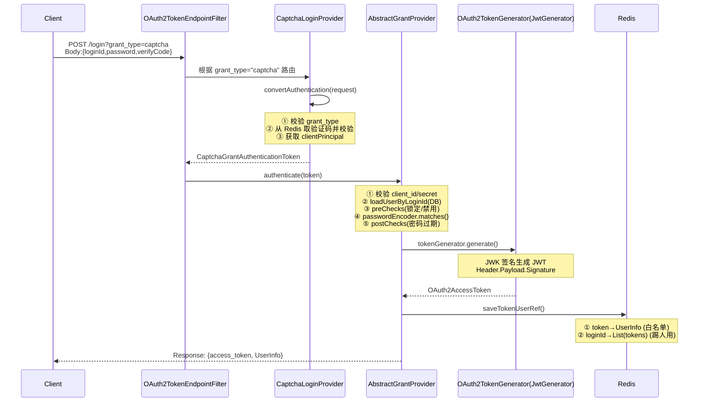
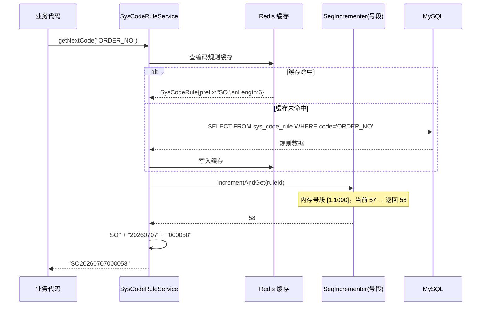
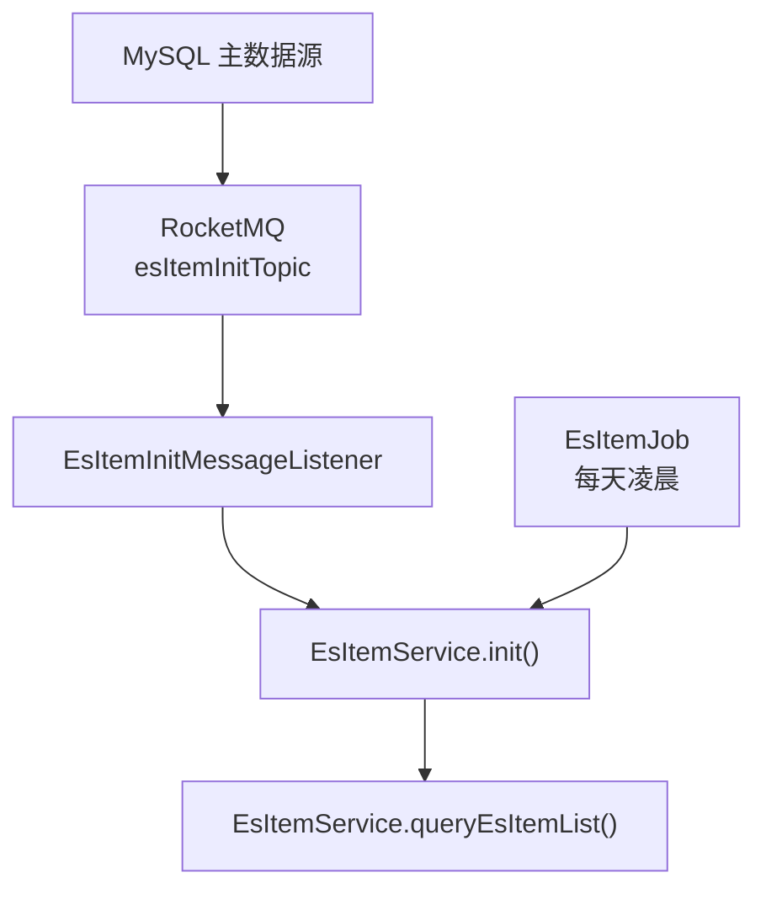
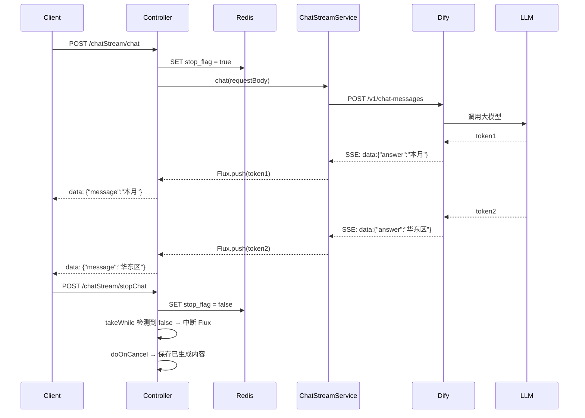
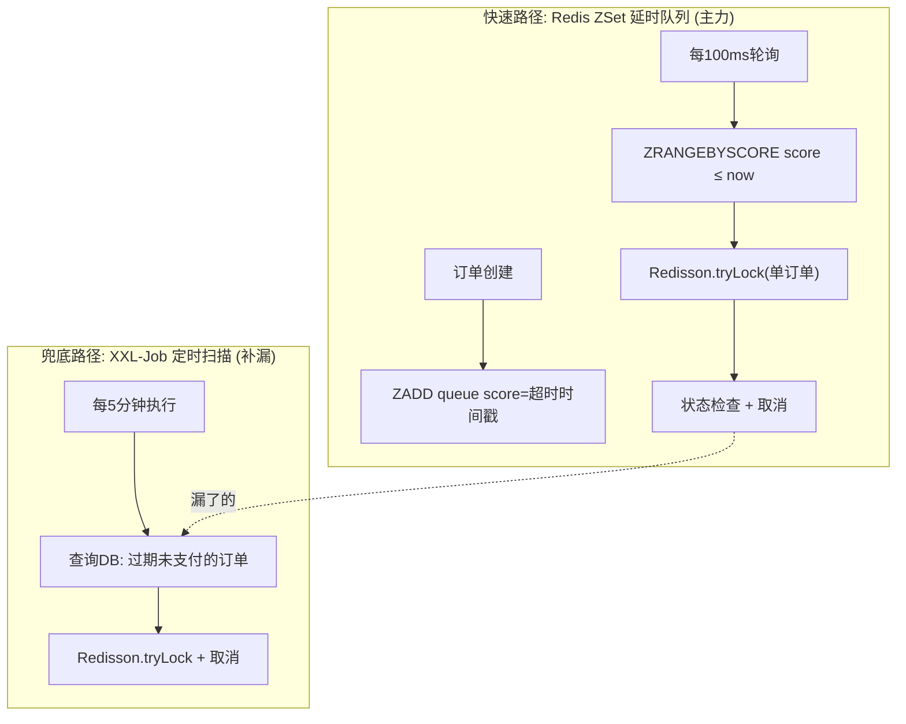

# 领益智造 · Java 高级工程师 / 架构师 面试应对文档 V6

> **基于 CCS 渠道云项目（ccs-services + ccs-common）实战 + 领益智造业务调研**
>
> **V6 定位**：面向中级程序员的深度讲解版。每个技术亮点对其使用的**每个关键组件**都先讲清楚组件自身原理，再讲 CCS 如何使用和扩展，最后展示源码实现。读到任何一行代码都能理解"为什么这样写"。

---

## 目录

- [第〇部分 核心叙事主线](#第〇部分-核心叙事主线)
- [第一部分 项目陈述脚本](#第一部分-项目陈述脚本)
- [第二部分 十一大核心技术深度解析](#第二部分-十一大核心技术深度解析)
  - [2.1 认证体系：OAuth 2.0 + Spring Authorization Server + JWT](#21-认证体系oauth-20--spring-authorization-server--jwt)
  - [2.2 数据权限：自研 AOP 拦截器](#22-数据权限自研-aop-拦截器)
  - [2.3 分布式序列号：Redisson + DB 号段](#23-分布式序列号redisson--db-号段)
  - [2.4 ES 搜索：Spring Data Elasticsearch + 零停机重建](#24-es-搜索spring-data-elasticsearch--零停机重建)
  - [2.5 大批量计算：XXL-Job + 状态机](#25-大批量计算xxl-job--状态机)
  - [2.6 AI 流式对话：WebFlux + SSE + Dify](#26-ai-流式对话webflux--sse--dify)
  - [2.7 定制 Redis 缓存：CacheName 后缀 TTL + 事务感知驱逐](#27-定制-redis-缓存cachename-后缀-ttl--事务感知驱逐)
  - [2.8 代理方法扩展：AOP 驱动的插件机制](#28-代理方法扩展aop-驱动的插件机制)
  - [2.9 API 字段级加密：Jackson 序列化器注入 + SM4](#29-api-字段级加密jackson-序列化器注入--sm4)
  - [2.10 操作日志：AOP + 参数脱敏 + MQ 异步收集](#210-操作日志aop--参数脱敏--mq-异步收集)
  - [2.11 订单延时队列：Redis ZSet + XXL-Job 双重超时](#211-订单延时队列redis-zset--xxl-job-双重超时)
- [第三部分 领益智造与制造业面试侧重点](#第三部分-领益智造与制造业面试侧重点)
- [第四部分 高频面试问答库](#第四部分-高频面试问答库)

---

## 第〇部分 核心叙事主线

> **"我长期参与一个面向制造业的渠道分销云（SaaS）平台的研发与运维——CCS 渠道云。它服务的客户（如泉峰集团）是典型的离散制造业，平台要管理分销商、终端门店、进销存、销售合同、返利核算、财务结算这一整条渠道价值链。我对'制造业 + 复杂业务 + 多组织多账套 + 高一致性要求'这类场景有第一手的工程经验。"**

---

## 第一部分 项目陈述脚本

### 1.1 一句话定位

CCS（Channel Cloud Service）渠道云产品服务，面向制造业/快消行业的渠道分销管理 SaaS 平台。Spring Boot 3 + Spring Cloud Alibaba + 10 个业务微服务 + 1 网关 + 1 OpenAPI，覆盖"主数据 → 进销存 → 销售合同 → 市场返利 → 财务结算 → 消息/AI"全链路，支持多租户、多账套、行/列级数据权限。

### 1.2 技术栈全景

| 层次 | 选型 | 基于什么开源项目 | 核心原理概述 |
|------|------|----------------|------------|
| 框架 | Spring Boot 3 + Spring Cloud Alibaba | Boot 3 / Cloud 2022.x | IoC 容器 + 自动配置 |
| 注册配置 | Nacos | Alibaba Nacos 2.x | AP 协议(Distro) + CP(Raft) |
| 网关 | Spring Cloud Gateway | Netty/Reactor | 非阻塞事件驱动 I/O |
| 认证授权 | Spring Security 6 + JWT + Redis | Spring Authorization Server | OAuth 2.0 授权码协议 |
| ORM | MyBatis-Plus + dynamic-datasource | baomidou | 动态代理 + SQL 模板 |
| 数据库 | MySQL 8 + Druid + Flyway | Alibaba Druid / Flyway | 连接池 + DDL 版本管理 |
| 缓存/锁 | Redis + Redisson | Redisson | Lua 脚本原子操作 + 看门狗 |
| 消息 | RocketMQ | Apache RocketMQ | 发布订阅 + 消费者组 |
| 搜索 | Elasticsearch + IK 分词 | ES 8.x / IK Analyzer | 倒排索引 + 分词匹配 |
| 定时任务 | XXL-Job | xuxueli/xxl-job | 调度中心 + 执行器注册 |
| AI | Dify + SSE | langgenius/dify / Reactor | 响应式流 + HTTP 长连接 |
| 缓存扩展 | 定制 RedisCacheManager | Spring Data Redis | CacheManager 工厂模式 |
| 插件扩展 | @ProxyMethod AOP | Spring AOP Alliance | MethodInterceptor 拦截链 |
| 字段加密 | Jackson SerializerModifier + SM4 | Hutool SM4 | BeanSerializer 替换 |
| 审计日志 | @OperateLog + MQ | Spring AOP + RocketMQ | Around 切面 + 异步投递 |
| 延时队列 | Redis ZSet 延时队列 | Jedis | 跳表 + 分数排序 |

---

## 第二部分 十一大核心技术深度解析

---

### 2.1 认证体系：OAuth 2.0 + Spring Authorization Server + JWT

#### 2.1.1 涉及的组件及其原理

##### ① OAuth 2.0 协议是什么

OAuth 2.0 是一个**授权协议框架**——不是实现，是一套规范（RFC 6749）。它定义了"第三方应用如何在不获取用户密码的情况下，获得用户数据的访问权限"。

核心角色：
- **Resource Owner**（资源所有者）：用户
- **Client**（客户端）：第三方应用（如 CCS 前端）
- **Authorization Server**（授权服务器）：签发 Token 的服务（CCS 的 sys 服务）
- **Resource Server**（资源服务器）：存储受保护资源的服务（CCS 的各个业务微服务）

核心流程（授权码模式）：
```
用户 → 客户端："我要登录"
客户端 → 授权服务器：跳转 /oauth2/authorize?client_id=xxx
授权服务器 → 用户：呈现登录页
用户 → 授权服务器：输入账号密码
授权服务器 → 客户端：返回 authorization_code
客户端 → 授权服务器：POST /oauth2/token 用 code 换 token
授权服务器 → 客户端：返回 {access_token, refresh_token, expires_in}
客户端 → 资源服务器：Header: Authorization: Bearer {access_token}
```

##### ② Spring Authorization Server 的原理

Spring Authorization Server 是 Spring 官方对 OAuth 2.1 协议的实现。核心组件：

- `OAuth2AuthorizationServerConfigurer`：配置类，注册所有端点（`/oauth2/token` 等）
- `OAuth2TokenGenerator`：Token 生成器接口，默认实现是 `JwtGenerator`——调用 `JWK`（JSON Web Key）签名生成 JWT
- `OAuth2AuthorizationService`：存储已签发的授权信息（内存/JDBC/Redis）
- `RegisteredClientRepository`：存储注册的客户端信息（client_id + client_secret）

**Spring Authorization Server 的 Token 生成流程**：
```
1. OAuth2TokenEndpointFilter 收到 POST /oauth2/token
2. 根据 grant_type 查找对应的 AuthenticationProvider
3. Provider.authenticate() 执行认证逻辑
4. OAuth2TokenGenerator.generate(tokenContext) 生成 JWT
   - JwtGenerator 内部调用 JWK 签名
   - 生成 Header: {alg: "HS256", typ: "JWT"}
   - 生成 Payload: {sub, iss, aud, exp, iat, jti, ...}
   - 拼接: base64(Header).base64(Payload).base64(Signature)
5. 返回 OAuth2AccessToken 对象
```

##### ③ JWT 的结构和验签原理

JWT（JSON Web Token）由三部分组成，用 `.` 分隔：

```
eyJhbGciOiJIUzI1NiJ9.eyJzdWIiOiJ6aGFuZ3NhbiJ9.xK9m2pQ3...
   ↑ Header           ↑ Payload            ↑ Signature
   base64({            base64({             HMAC-SHA256(
     "alg":"HS256",      "sub":"zhangsan",    base64(Header)+"."+
     "typ":"JWT"         "iat":1234567890,    base64(Payload),
   })                    "exp":1234567890      secret_key
                       })                   )
```

验签原理：
1. 接收方用同样的密钥对 `base64(Header).base64(Payload)` 做 HMAC-SHA256
2. 对比计算结果和 Token 中的 Signature
3. 相同 → Token 未被篡改；不同 → Token 被篡改或密钥不对

**关键认知：JWT 是"自包含"的——验签不需要查数据库，只需要密钥。** 这意味着网关可以在不回调授权服务器的情况下验证 Token，这对网关这种流量入口至关重要。

##### ④ Redis 在认证体系中的角色

**为什么 JWT 需要 Redis？** JWT 的无状态验签有天然缺陷：Token 签发后无法主动失效。如果管理员要踢人下线，JWT 本身做不到——因为 Token 没有被篡改，验签总是通过的。

**Redis 白名单机制**：
- 登录时：`SET login:token:{tokenValue} = UserInfo`，过期时间与 JWT 一致
- 网关校验时：`EXISTS login:token:{tokenValue}` → 存在则放行
- 踢人时：`DEL login:token:{tokenValue}` → 网关下次校验时查不到，拒绝

##### ⑤ TransmittableThreadLocal（TTL）的原理

**ThreadLocal 基础**：每个 Java 线程有一个 `ThreadLocalMap`（在 Thread 对象的 `threadLocals` 字段中），key 是 ThreadLocal 对象的弱引用，value 是存储的值。同一线程内任意代码都可以 `threadLocal.get()` 取到。

**ThreadLocal 的致命缺陷**：线程池复用。线程 A 处理请求 1 后 ThreadLocal 里残留了用户 1 的信息，线程 A 再去处理请求 2 时，如果没有重新 set，就会读到用户 1 的信息（串号）。

**TransmittableThreadLocal 的解决方案**：
- 继承 `InheritableThreadLocal`：子线程创建时自动拷贝父线程的 ThreadLocal 值
- 装饰线程池：`TtlExecutors.getTtlExecutor(executor)` 包装线程池，在 `Runnable.run()` 前后自动 snapshot → 恢复上下文
- 这样异步任务（如 `CompletableFuture.runAsync()`）也能拿到正确的用户上下文

#### 2.1.2 CCS 的实现：自定义 Grant Type 扩展 OAuth 2.0

Spring Authorization Server 默认支持 4 种 Grant Type。CCS 通过继承 `OAuth2AuthorizationGrantAuthenticationToken` 扩展了 8 种：

```
OAuth2AuthorizationGrantAuthenticationToken          ← Spring 标准基类
  └── BaseGrantAuthenticationToken                    ← CCS 扩展
        ├── CaptchaGrantAuthenticationToken           ← grant_type=captcha
        ├── SmsCodeGrantAuthenticationToken           ← grant_type=sms_code
        ├── OtpGrantAuthenticationToken               ← grant_type=otp
        ├── AppLoginGrantAuthenticationToken          ← grant_type=appLogin
        ├── LoginIdAuthenticationToken                ← grant_type=login_id_inner
        └── ... (微信扫码等 3 种)

// CaptchaGrantAuthenticationToken.java
public class CaptchaGrantAuthenticationToken extends BaseGrantAuthenticationToken {
    public static final AuthorizationGrantType GRANT_TYPE =
        new AuthorizationGrantType("captcha");  // 向 Spring 注册新的 grant_type 字符串
}
```

**Spring 的 Provider 路由原理**：`OAuth2TokenEndpointFilter` 收到请求后，从 `request.getParameter("grant_type")` 获取类型字符串，遍历所有 `AuthenticationProvider.supports(Class)` 找到匹配的 Provider。

#### 2.1.3 完整认证链路（以验证码登录为例）



#### 2.1.4 关键源码

```java
// ====== 自定义 Grant Type 入口：CaptchaLoginProvider ======
@Slf4j @Component
public class CaptchaLoginProvider extends AbstractGrantProvider<CaptchaGrantAuthenticationToken> {

    @Value("${ccs.verifyCodeLogin:true}")
    private boolean verifyCodeLogin;  // 验证码开关，可通过 Nacos 动态关

    @Override
    public CaptchaGrantAuthenticationToken convertAuthentication(HttpServletRequest request) {
        // ① 路由判断：URL 参数 grant_type == "captcha" ?
        String grantType = request.getParameter("grant_type");
        if (!CaptchaGrantAuthenticationToken.GRANT_TYPE.getValue().equals(grantType)) {
            return null;  // 不匹配 → 交给下一个 Provider
        }

        // ② 读请求体 → LoginRequest（loginId + password + verifyCode）
        LoginRequest loginRequest = extracted(request);

        // ③ 验证码校验
        if (verifyCodeLogin) {
            String verifyCode = (String) redisTemplate.opsForValue()
                .get(SysConstants.VERIFY_CODE + request.getSession().getId());
            redisTemplate.delete(SysConstants.VERIFY_CODE + request.getSession().getId());
            if (!StringUtils.equalsIgnoreCase(verifyCode, loginRequest.getVerifyCode())) {
                throw new MeicloudException(CommonErrorCode.LOGIN_VERIFY_CODE_ERROR);
            }
        }

        // ④ 构建自定义 Token
        Authentication clientPrincipal = SecurityContextHolder.getContext().getAuthentication();
        return new CaptchaGrantAuthenticationToken(clientPrincipal, null, loginRequest);
    }
}

// ====== 认证核心：AbstractGrantProvider ======
@Slf4j
public abstract class AbstractGrantProvider<A extends BaseGrantAuthenticationToken>
        extends AbstractLoginProvider
        implements OAuth2GrantProvider<A> {

    @Autowired
    private OAuth2TokenGenerator<? extends OAuth2Token> tokenGenerator;

    public Authentication doAuthenticate(A token) throws AuthenticationException {
        // ① 校验客户端身份（client_id + client_secret）
        OAuth2ClientAuthenticationToken clientPrincipal =
            OAuth2AuthenticationProviderUtils.getAuthenticatedClientElseThrowInvalidClient(token);
        RegisteredClient registeredClient = clientPrincipal.getRegisteredClient();

        // ② 从数据库加载用户
        LoginRequest loginRequest = token.getRequest();
        LoginUser loginUser = loadUserByLoginId(loginRequest.getLoginId());

        // ③ 前置检查（锁定/禁用/过期 → throw exception）
        preAuthenticationChecks.check(loginUser);

        // ④ 密码校验（BCryptPasswordEncoder.matches）
        additionalAuthenticationChecks(loginUser, loginRequest.getPassword());

        // ⑤ 后置检查（密码过期 → throw exception）
        postAuthenticationChecks.check(loginUser);

        // ⑥ 生成 OAuth 2.0 AccessToken（JWT 格式）
        Authentication authenticationToken =
            new AuthenticatedToken(loginUser, Collections.emptySet());
        return createAccessTokenAuthenticationToken(
            token, registeredClient, authenticationToken, clientPrincipal);
    }

    // JWT 生成
    protected OAuth2AccessTokenAuthenticationToken createAccessTokenAuthenticationToken(...) {
        DefaultOAuth2TokenContext.Builder tokenContextBuilder = DefaultOAuth2TokenContext.builder()
            .registeredClient(registeredClient)
            .principal(principal)
            .authorizedScopes(registeredClient.getScopes())
            .authorizationGrantType(AuthorizationGrantType.AUTHORIZATION_CODE)
            .authorizationGrant(authorizationGrant);

        // ★ tokenGenerator.generate() 内部调用 JwtGenerator → JWK 签名 → JWT 字符串
        OAuth2TokenContext tokenContext = tokenContextBuilder
            .tokenType(OAuth2TokenType.ACCESS_TOKEN).build();
        OAuth2Token generatedAccessToken = tokenGenerator.generate(tokenContext);

        OAuth2AccessToken accessToken = new OAuth2AccessToken(
            OAuth2AccessToken.TokenType.BEARER,
            generatedAccessToken.getTokenValue(),   // JWT 字符串
            generatedAccessToken.getIssuedAt(),
            generatedAccessToken.getExpiresAt(),
            tokenContext.getAuthorizedScopes());

        Map<String, Object> additionalParameters =
            Collections.singletonMap("principal", principal);
        return new OAuth2AccessTokenAuthenticationToken(
            registeredClient, clientPrincipal, accessToken, null, additionalParameters);
    }
}

// ====== 登录成功后的 Redis 存储：UserLoginService ======
@Slf4j @Component
public class UserLoginService {

    public void saveTokenUserRef(LoginUser loginUser, OAuth2Token accessToken) {
        UserInfo userInfo = loginUser.getUser();
        long expireInSeconds = Duration.between(Instant.now(),
            accessToken.getExpiresAt()).getSeconds();

        // ★ Key 设计：
        // ① token → UserInfo：网关用 hasKey() 做白名单校验
        tokenAssociationService.associate(
            accessToken.getTokenValue(), LOGIN_TOKEN_USER_INFO, userInfo);

        // ② loginId → List<token>：管理员踢人时遍历删除所有 token
        String loginIdTokenCacheKey =
            SecurityConstant.getLoginIdTokenCacheKey(userInfo.getLoginId());
        redisTemplate.opsForList().rightPush(
            loginIdTokenCacheKey, accessToken.getTokenValue());
        redisTemplate.expire(loginIdTokenCacheKey, expireInSeconds + 1, TimeUnit.SECONDS);
    }
}

// ====== 登录成功 Handler ======
@Component
public class AuthenticationSuccessHandler
        implements org.springframework.security.web.authentication.AuthenticationSuccessHandler {
    @Override
    public void onAuthenticationSuccess(HttpServletRequest request,
            HttpServletResponse response, Authentication authentication) {
        OAuth2AccessTokenAuthenticationToken token =
            (OAuth2AccessTokenAuthenticationToken) authentication;

        // ① 响应头写入 Token
        response.setHeader(HttpHeaders.AUTHORIZATION,
            "Bearer " + token.getAccessToken().getTokenValue());

        // ② Redis 存储 + 返回 UserInfo
        AuthenticatedToken authToken = (AuthenticatedToken)
            token.getAdditionalParameters().get("principal");
        loginManager.handleLoginSuccess(authToken.getLoginUser(), token.getAccessToken());
        BaseResponse<UserInfo> resp = BaseResponse.success(authToken.getLoginUser().getUser());
        response.getWriter().println(JSON.toJSONString(resp));
    }
}
```

#### 2.1.5 与标准的差异总结

| 维度 | OAuth 2.0 标准 | CCS 实现 | 原因 |
|------|---------------|---------|------|
| Grant Type | 4 种 | **8 种自定义** | 业务需要验证码/短信/微信/OTP 等登录方式 |
| Token 存储 | 无强制要求 | **Redis 白名单 + 双向映射** | JWT 无状态验签 + 主动踢人能力 |
| 用户信息 | 无标准定义 | **自建 UserInfo** | 业务字段（tenantId/setsOfBooksId）远超 OIDC Claim |
| 单点登出 | 无标准 | **loginId→List\<token\> + 遍历删除** | 管理员踢人 + IAM 同步登出 |

#### 2.1.6 优缺点

**优点**：
1. 基于 Spring 官方框架，持续维护。自定义 Grant Type 通过扩展点实现，不 hack 框架
2. JWT 无状态验签：网关本地 `verifyWith(key)` 即可，不回调授权服务器
3. Redis 白名单补位：删除 key 即刻踢人，弥补 JWT 无法主动失效
4. TTL 保证 `@Async`、线程池、MQ 消费等异步场景不丢用户上下文

**缺点**：
1. OAuth 2.0 协议层对内部 SaaS 偏重，client 管理形同虚设
2. JWT Payload 不宜过重，UserInfo 存 Redis 而非 JWT 内 → 非"完全自包含"
3. Redis 不可用时，所有已登录用户都被判为"离线"（单点风险）

---

### 2.2 数据权限：自研 AOP 拦截器

#### 2.2.1 涉及的组件及其原理

##### ① Spring AOP 的原理

**AOP（Aspect-Oriented Programming，面向切面编程）** 的核心思想是：把"横切关注点"（如日志、权限、事务）从业务代码中分离出来，通过"切面"织入。

**Spring AOP 的实现是动态代理**：

```
你的代码：  @Service
          public class UserService {
              public User getUser(Long id) { ... }  ← 目标方法
          }

Spring 容器中实际存的是：
          CGLIB 生成的代理对象 UserService$$SpringCGLIB$$0
              public User getUser(Long id) {
                  // ★ 前置通知（Before）：执行 AOP 逻辑
                  proceed();  // ★ 调用真正的 UserService.getUser()
                  // ★ 后置通知（After）：执行 AOP 逻辑
              }
```

**JDK 动态代理 vs CGLIB**：

| | JDK 动态代理 | CGLIB |
|--|------------|-------|
| 代理方式 | 实现接口 | 继承目标类 |
| 限制 | 目标类必须有接口 | 目标类不能是 final |
| 性能 | 反射调用，稍慢 | 字节码生成，稍快 |
| Spring Boot 3 默认 | — | ✅ CGLIB |

Spring Boot 3 默认 `proxyTargetClass=true`，即使有接口也用 CGLIB（原因：统一行为、避免类型转换异常）。

**Advice 类型**：
- `@Before`：目标方法执行前
- `@AfterReturning`：目标方法正常返回后
- `@AfterThrowing`：目标方法抛异常后
- `@After`：目标方法执行后（不论是否抛异常）
- `@Around`：包围目标方法，手动控制是否调用 `proceed()`

CCS 的数据权限拦截器用 `@Before`，因为只需要在目标方法执行前注入条件到参数。操作日志用 `@Around`，因为需要在方法执行前后都能做事。

##### ② Condition 对象的 SQL 生成原理

`Condition` 是 CCS 自定义的一个抽象层，位于业务代码和 MyBatis 之间：

```java
// Condition.java
public class Condition {
    private final String operation;       // "in" / "like" / "eq" / "null" / "gt"
    private final String tableFieldName;  // "a.org_id"
    private Object value;                 // ["1001", "1002"]
    private String logic;                 // "and" / "or"
    private List<Condition> andConditions;
    private List<Condition> orConditions;
}
```

**转换链路**：`Condition 列表 → DslParser → MyBatis QueryWrapper → SQL 字符串`

```
Condition("in", "a.org_id", ["1001","1002"], "and")
  .or(Condition("null", "a.org_id"))

        ↓ DslParser.parseToWrapper()

QueryWrapper: lambda {
    and(w -> w.in("a.org_id", "1001","1002").or().isNull("a.org_id"))
}

        ↓ MyBatis XML ${ew.sqlSegment}

SQL: (a.org_id IN ('1001','1002') OR a.org_id IS NULL)
```

##### ③ 为什么用 Feign 远程调用查权限

`DataPermissionInterceptor` 所在的 `ccs-remote-common` 模块是在**消费方**（如 vcs 服务）运行的。权限数据存储在 **sys 服务**的数据库中。消费方需要通过 Feign 调用 sys 服务的接口查询。

这是一个典型的"权限数据集中管理、消费方分布式查询"的架构——权限规则在 sys 服务统一维护，所有业务服务通过 Feign 获取当前用户的授权范围。

#### 2.2.2 与标准方案的对比

| 维度 | MyBatis 拦截器（TenantLine） | Spring Security ACL | **CCS AOP 拦截器** |
|------|---------------------------|--------------------|--------------------|
| 注入层 | MyBatis StatementHandler | DB ACL 表 | **Service 方法参数（conditionList）** |
| 多维度 | 单一 | 支持 | **AND 组合（org+company+channel 等 21 种）** |
| 跳过机制 | 无 | 无 | **isDataPermissionControl=false** |
| 包含下级 | 不支持 | 不支持 | **isIncludeChilds=true 递归查询** |

#### 2.2.3 完整调用链路

```
① 请求到达 Controller
② Controller 调用 Service 方法（方法上有 @DataPermisson 注解）
③ Spring AOP 代理拦截 → DataPermissionInterceptor.before()
④ 反射读取注解配置（维度列表、字段名列表）
⑤ ServiceUserInfoUtil.getUserInfo() → ThreadLocal 取当前用户
⑥ sysPermissionUtil.getDataPermission() → Feign 远程调用 sys 服务
⑦ sys 服务查数据库，返回授权范围（可见的 org_id 列表）
⑧ 组装 Condition：new Condition("in", fieldName, ids, "and").or(new Condition("null", fieldName))
⑨ 注入到 BaseSearchRequest.conditionList
⑩ 原 Service 方法执行 → MyBatis 从 conditionList 生成 SQL → 附加 WHERE 条件
```

#### 2.2.4 关键源码

```java
// ====== 注解定义 ======
@Retention(RUNTIME) @Target(METHOD) @Inherited @Documented
public @interface DataPermisson {
    LinePermDataType[] dataPermissionTypes();    // [ORG, COMPANY, CHANNEL, ...]
    String[] tableFieldNames() default "";       // [a.org_id, a.company_code, ...]
    boolean isIncludeChilds() default false;     // 是否递归包含下级
    PermFieldType fieldType() default ID;        // 字段类型：ID 或 CODE
    PermFieldType[] fieldTypes() default {};
}

// ====== AOP 拦截器核心 ======
@Aspect @Component
public class DataPermissionInterceptor {

    @Autowired private SysPermissionUtil sysPermissionUtil;

    @Before("@annotation(com.meicloud.ccs.sys.api.annotations.DataPermisson)")
    public void before(JoinPoint point) {
        // ① 反射获取注解
        MethodSignature sig = (MethodSignature) point.getSignature();
        DataPermisson dp = sig.getMethod().getDeclaredAnnotation(DataPermisson.class);

        // ② 遍历参数，找到 BaseSearchRequest
        for (Object arg : point.getArgs()) {
            if (arg instanceof BaseSearchRequest) {
                dataPermissonHandler((BaseSearchRequest) arg, dp);
            }
        }
    }

    private void dataPermissonHandler(BaseSearchRequest args, DataPermisson dp) {
        // ③ 显式跳过机制
        if (False.equals(args.getIsDataPermissionControl())) return;

        // ④ ThreadLocal 取用户
        UserInfo user = ServiceUserInfoUtil.getUserInfo();

        List<Condition> list = new ArrayList<>();
        for (int i = 0; i < dp.dataPermissionTypes().length; i++) {
            // ⑤ Feign 远程查询
            SysLinePermAuthorizedResponseDTO resp =
                sysPermissionUtil.getDataPermission(user.getTenantId(),
                    user.getSetsOfBooksId(), user.getUserId().toString(),
                    dp.dataPermissionTypes()[i], dp.isIncludeChilds());

            if (resp.getAuthorizeStatus() == AuthorizeStatus.ALL_PERMITTED) return;

            // ⑥ 根据字段类型拼装条件
            List<String> values = resp.getPerms().stream()
                .map(isCode ? SysLinePermDataResponseDTO::getDataCode
                           : SysLinePermDataResponseDTO::getDataPk)
                .collect(toList());
            if (CollectionUtils.isEmpty(values)) {
                values.add(isCode ? "0" : "-176671");  // 哨兵值
            }
            // ★ 核心：IN + IS NULL 组合
            Condition condition = new Condition("in", dp.tableFieldNames()[i], values, "and")
                    .or(new Condition("null", dp.tableFieldNames()[i]));
            list.add(condition);
        }
        // ⑦ 注入到请求参数
        args.getConditionList().addAll(list);
    }
}
```

**最终 SQL 效果**：
```sql
SELECT * FROM sale_order a WHERE a.is_del = 0
  AND (a.org_id IN ('1001','1002') OR a.org_id IS NULL)
  AND (a.company_code IN ('C001') OR a.company_code IS NULL);
```

#### 2.2.5 优缺点

**优点**：零侵入注解 + SQL 层过滤（走索引、分页准确）+ 多维度 AND 组合 + 可显式跳过 + IS NULL 兜底
**缺点**：多维度时多次 Feign 调用（可优化为批量查询）+ 依赖 XML 中写 `${ew.sqlSegment}`（无编译期检查）

---

### 2.3 分布式序列号：Redisson + DB 号段

#### 2.3.1 涉及的组件及其原理

##### ① Redisson 分布式锁的原理

**为什么需要分布式锁？** 单体应用中 `synchronized` 或 `ReentrantLock` 只锁当前 JVM。多台服务器部署时，需要跨 JVM 的锁——这就是分布式锁。

**Redisson 基于 Redis 实现分布式锁的核心机制**：

```
加锁过程（Lua 脚本，原子执行）：
  if redis.call('exists', KEYS[1]) == 0 then
      redis.call('hincrby', KEYS[1], ARGV[2], 1);   -- 重入计数
      redis.call('pexpire', KEYS[1], ARGV[1]);        -- 设过期时间
      return nil;  -- 加锁成功
  elseif redis.call('hexists', KEYS[1], ARGV[2]) == 1 then
      redis.call('hincrby', KEYS[1], ARGV[2], 1);   -- 同线程重入
      redis.call('pexpire', KEYS[1], ARGV[1]);        -- 续期
      return nil;  -- 加锁成功
  else
      return redis.call('pttl', KEYS[1]);  -- 返回剩余时间（加锁失败）
  end;
```

**数据结构**：Redis 中用 **Hash** 存储锁信息
```
Key: locks:SysCodeRule::123    (锁名称)
  field: "threadId:connectionId"  → value: 1  (重入计数)
```

**看门狗（Watchdog）机制**：
- 如果显式指定了锁超时时间（如 `lock(10, SECONDS)`），Redisson 不启动看门狗
- 如果 `lock()` 不传参或传 `-1`，Redisson 启动看门狗——每 `lockWatchdogTimeout/3`（默认 10 秒）续期 `lockWatchdogTimeout`（默认 30 秒）
- 如果 JVM 崩溃 → 看门狗停止续期 → 锁在 30 秒后自动释放

**CCS 中的用法**：
```java
RLock lock = redissonManager.getRedisson()
    .getLock("locks:SysCodeRule::" + ruleId);
lock.lock(-1, TimeUnit.MINUTES);  // -1 = 启用看门狗，不设超时
try { /* 取号操作 */ } finally { lock.unlock(); }
```

##### ② 号段（Segment）模式的原理

**问题**：如果每次都去数据库取号，并发高时数据库压力大、锁竞争激烈。

**号段模式的解决思路**（来自美团 Leaf）：
```
数据库表 leaf_alloc:
  biz_tag | max_id | step | update_time
  order   | 2000   | 1000 | 2026-07-06

取号段：
  UPDATE leaf_alloc SET max_id = max_id + step WHERE biz_tag = 'order'
  → max_id 从 2000 变成 3000
  → 当前节点拿到号段 [2001, 3000]，缓存到内存

内存发号：
  节点从 [2001, 3000] 中逐个发放 → 发完后再去数据库取下一个号段
  原来：每次取号 → 1 次 DB 操作
  现在：每 1000 次取号 → 1 次 DB 操作
```

CCS 的 `SeqIncrementer` 接口就是号段模式的核心：
```java
public interface SeqIncrementer {
    void remove(Serializable key);              // 编码规则变更时清空号段
    Long get(Serializable key);                 // 查看当前号段值
    Long incrementAndGet(Serializable key);     // 自增 + 返回（核心）
}
```

##### ③ 编码规则的配置化设计

编码规则存储在 `sys_code_rule` 表中：

```sql
CREATE TABLE sys_code_rule (
    id BIGINT PRIMARY KEY,
    code VARCHAR(50),              -- 编码标识："ORDER_NO"、"CONTRACT_NO"
    first_prefix VARCHAR(50),      -- 第一前缀："SO"
    first_prefix_type INT,         -- 前缀类型：1=固定字符串, 2=日期格式
    second_prefix VARCHAR(50),     -- 第二前缀："yyyyMMdd"
    second_prefix_type INT,        --
    first_suffix VARCHAR(50),      -- 后缀
    first_suffix_type INT,         --
    sn_length BIGINT,              -- 流水号长度：6
    sn_min_value BIGINT,           -- 流水号起始值：1
    sn_max_value BIGINT,           -- 流水号最大值：999999
    fill_zero_flag INT,            -- 是否补零
    is_coverage INT,               -- 是否含账套随机码
    tenant_id VARCHAR(50),
    sets_of_books_id BIGINT
);
```

#### 2.3.2 完整取号流程



#### 2.3.3 关键源码

```java
// ====== 对外接口 ======
@Transactional
public String getNextCode(String tenantId, Long setsOfBooksId, String ruleCode) {
    return updateAndGetCode(new SysCodeRuleReqDTO(tenantId, setsOfBooksId, ruleCode));
}

// ====== 自动创建机制 ======
public String updateAndGetCode(SysCodeRuleReqDTO reqDTO) {
    String codeNo = getCodeRuleCode(reqDTO);   // 带缓存取号
    if (StringUtils.isEmpty(codeNo)) {
        createCodeRule(reqDTO);               // ★ 自动创建规则
        codeNo = getCodeRuleCode(reqDTO);     // 递归取号
    }
    return codeNo;
}

// ====== 带缓存的取号 ======
private String getCodeRuleCode(SysCodeRuleReqDTO request) {
    Cache cache = redisCacheService.getCache(getClass().getName());
    SysCodeRule rule = cache.get(cacheKey, SysCodeRule.class);  // Redis 读
    if (rule == null) {
        rule = getSysCodeRule(request);        // DB 读
        if (rule != null) cache.put(cacheKey, rule);  // 写回 Redis
    }
    return doConcatRuleCode(rule);
}

// ====== 编码拼接 ======
private String doConcatRuleCode(SysCodeRule rule) {
    // 前缀：可能是固定字符串 "SO"，也可能是日期格式 → "20260707"
    String firstPrefix  = getPrefixOrSuffix(rule.getFirstPrefixType(),
                                            rule.getFirstPrefix(), now);
    String secondPrefix = getPrefixOrSuffix(rule.getSecondPrefixType(),
                                            rule.getSecondPrefix(), now);

    // ★ 从号段自增器取流水号（内存发号，用完才去 DB 取新段）
    long serialNo = seqIncrementer.incrementAndGet(rule.getId());

    // 补零格式化
    NumberFormat nf = NumberFormat.getInstance();
    nf.setGroupingUsed(false);
    nf.setMinimumIntegerDigits(rule.getSnLength().intValue());  // 6 → "000058"
    return firstPrefix + secondPrefix + nf.format(serialNo) + suffix;
}

// ====== 自动创建编码规则（Redisson 锁 + DCL）=====
private void createCodeRule(SysCodeRuleReqDTO request) {
    // 查默认账套的模板规则
    SysCodeRule template = queryTemplateRule(request.getCode());

    // ★ Redisson 分布式锁
    RLock lock = redissonManager.getRedisson()
        .getLock("locks:SysCodeRule::" + template.getId());
    lock.lock(-1, TimeUnit.MINUTES);  // -1 = 启用看门狗

    try {
        // ★ DCL：双重检查
        if (getSysCodeRule(request) != null) return;
        // 复制模板到目标账套 + 创建序列号记录
        template.setSetsOfBooksId(request.getSetsOfBooksId());
        template.setId(null);
        TransactionOperations.withoutTransaction().executeWithoutResult(status -> {
            this.save(template);
            sysCodeSeqService.createdCodeSeq(template);
        });
    } finally { lock.unlock(); }
}
```

#### 2.3.4 与业界方案对比

| 方案 | 格式 | 性能 | 业务含义 | 部署依赖 |
|------|------|------|---------|---------|
| 数据库自增 | 纯数字 | 低 | 无 | MySQL |
| UUID | 36位字符串 | 高 | 无 | 无 |
| 雪花算法 | 纯数字 | 极高 | 无 | 无 |
| 美团 Leaf | 纯数字 | 极高 | 无 | Leaf 服务 |
| **CCS Redisson+号段** | **可配置** | **中高** | **有（SO20260707000058）** | **Redis + MySQL** |

#### 2.3.5 优缺点

**优点**：业务可读、配置化管理、自动创建、Redisson 看门狗保证锁不无限持有
**缺点**：号段空洞（服务重启时内存号段浪费）、锁粒度过大（同一编码规则的所有取号互斥）

---

### 2.4 ES 搜索：Spring Data Elasticsearch + 零停机重建

#### 2.4.1 涉及的组件及其原理

##### ① Elasticsearch 倒排索引的原理

**正排索引 vs 倒排索引**：

```
正排索引（MySQL B+树）：
  文档1 → [华为, 手机, 5G, 5000元]
  文档2 → [小米, 手机, 快充, 3000元]
  搜索：从头遍历每个文档，检查是否包含关键词 → O(n)

倒排索引（ES）：
  华为    → [文档1]
  手机    → [文档1, 文档2]
  5G      → [文档1]
  5000元  → [文档1]
  小米    → [文档2]
  快充    → [文档2]
  3000元  → [文档2]
  搜索：直接查字典 → O(1)
```

**ES 的底层数据结构**：
- Term Dictionary（词项字典）：有序的词项列表，用 FST（有限状态转换器）存储，支持前缀压缩
- Posting List（倒排列表）：每个词项对应的文档 ID 列表，用 FOR（Frame Of Reference）编码 + Roaring Bitmap 压缩
- 搜索时：FST 快速定位词项 → 读取 Posting List → 合并（AND/OR 交集） → 排序 → 返回

**内存 vs 磁盘**：
- Term Dictionary 在内存中（FST 结构紧凑）
- Posting List 可以放在磁盘上（OS Page Cache 热数据）
- 这就是为什么 ES 搜索比 MySQL 快——MySQL 的全表扫描每次都从磁盘读数据，ES 的索引结构在内存中

##### ② IK 分词器的原理

IK 分词器是 ES 的中文分词插件。中文分词的难点是没有空格分隔，需要根据词典来切分。

```
ik_max_word（索引用，细粒度）："中华人民共和国"
  → 中华 | 华人 | 人民 | 共和国 | 中华人民共和国
  → 尽可能多切，提高召回率

ik_smart（搜索用，粗粒度）："中华人民共和国"
  → 中华人民共和国
  → 最粗粒度，提高准确率
```

CCS 中 `specs` 字段的配置：
```java
@Field(type = FieldType.Text,
       analyzer = "ik_max_word",      // 写入时细粒度切分
       searchAnalyzer = "ik_smart")   // 搜索时粗粒度匹配
```

##### ③ ES 别名（Alias）机制的零停机原理

ES 的别名类似文件系统的符号链接。业务代码读写的始终是别名 `esitem`，别名可以动态切换到不同的物理索引。

```
esitem (别名) → esitem_1712300000 (物理索引1) — 当前服务的索引
重建过程：
  1. 创建 esitem_1725000000 (物理索引2)
  2. 向新索引写入全部数据
  3. 原子操作：别名切换 → esitem → esitem_1725000000
  4. 删除 esitem_1712300000
  整个过程业务查询无感知
```

##### ④ Spring Data Elasticsearch 的分层

```
业务代码
  ↓
EsItemService (使用 template.search() / template.save())
  ↓
ElasticsearchOperations 接口
  ↓ 新版 Client（elasticsearch-java）
ElasticsearchClient  ← 底层 ES 客户端
  ↓ HTTP
Elasticsearch 集群
```

CCS 同时注入了 `ElasticsearchOperations`（Spring 封装）和 `ElasticsearchClient`（原始客户端），根据不同场景选择使用。

#### 2.4.2 同步架构



#### 2.4.3 关键源码

```java
// ====== 索引实体 ======
@Document(indexName = "esitem") @Setting(shards = 1, replicas = 1)
public class EsItem {
    @Field(type = FieldType.Long)    private Long itemId;
    @Field(type = FieldType.Keyword) private String itemName;    // 精确匹配
    @Field(type = FieldType.Keyword) private String itemCode;
    @Field(type = FieldType.Text, analyzer = "ik_max_word", searchAnalyzer = "ik_smart")
    private String specs;              // 中文全文检索
    @Field(type = FieldType.Object)  private List<EsCust> custList;  // 嵌套对象
}

// ====== 零停机索引重建 ======
private Status init(ExecuteContext context) {
    if (existsIndex) {
        // ① 创建新索引 esitem_timestamp
        IndexCoordinates newIdx = IndexCoordinates.of(aliasName + "_" + System.currentTimeMillis());
        ops.create(settings, Document.from(mapping));

        // ② 分页写入全量数据
        Status status = getDataAndWriteToES(newIdx, context);
        if (status == SUCCESS) {
            // ③ 别名切换 → 删旧索引
            template.indexOps(IndexCoordinates.of(oldIdxName)).delete();
            addIndexAlias(ops, newIdx.getIndexName(), aliasName);
        } else {
            ops.delete();  // 失败则删临时索引，旧索引继续服务
        }
    }
}

// ====== 搜索查询（Bool 组合查询） ======
public List<EsItemResponseDTO> queryEsItemList(EsItemSearchDTO param) {
    BoolQuery.Builder bq = QueryBuilders.bool();

    // 关键词：term(精确) + wildcard(模糊) 双路径
    bq.must(b -> b.bool(bq2 ->
        bq2.should(t -> t.term("itemName", keyword))
           .should(t -> t.wildcard("itemName", "*" + keyword + "*"))));

    // 分类筛选
    if (param.getBigClassId() != null)
        bq.must(b -> b.term(t -> t.field("bigClassId").value(param.getBigClassId())));

    // 价格范围
    bq.must(b -> b.range(r -> r.field("applyPrice").gte(JsonData.of(lowPrice))));

    // 客户可售范围
    bq.must(custDimensionQuery());

    SearchHits<EsItem> hits = template.search(nativeQuery, EsItem.class);
    return hits.stream().map(SearchHit::getContent).collect(toList());
}
```

#### 2.4.4 优缺点

**优点**：零停机重建、MQ+定时双链路最终一致、价格实时查 DB 而非存 ES（避免频繁刷新）
**缺点**：MQ 增量"全量"重建而非增量更新（成本高）、非强一致（最多 24h 兜底）

---

### 2.5 大批量计算：XXL-Job + 状态机

#### 2.5.1 涉及的组件及其原理

##### ① XXL-Job 的调度架构

XXL-Job 是"调度中心 + 执行器"的架构：

```
┌─────────────────────┐
│   XXL-Job Admin      │  ← 调度中心（Web 控制台）
│   (调度中心)          │  负责：任务管理、Cron 解析、触发调度
└──────────┬──────────┘
           │ HTTP 调用
    ┌──────┴──────────┐
    │   执行器集群      │  ← 部署在业务服务中
    │  (Executor)      │  负责：接收调度请求、执行任务
    │  Executor1/2/3   │
    └─────────────────┘
```

**注册发现**：执行器启动时自动向调度中心注册（心跳 30 秒）
**任务触发**：调度中心根据 Cron 表达式计算下次触发时间 → 到达时间 → HTTP POST 调用执行器的 `/run` 接口
**分片广播**：调度中心把 `shardIndex` 和 `shardTotal` 传给执行器，执行器根据 `id % shardTotal == shardIndex` 决定处理哪些数据

##### ② 模板方法（Template Method）模式

```java
// 抽象基类定义算法骨架
public abstract class AbstractSimpleXxlJob {
    public void execute(XxlJobContext context) {
        beforeExecute(context);    // 固定步骤1：设用户 + 记录开始
        doExecute(context);        // 可变步骤：子类实现
        afterExecution(context);   // 固定步骤3：记录耗时/异常
    }
    protected abstract void doExecute(XxlJobContext context);
}

// 子类只实现可变步骤
public class RebateCalcJob extends AbstractSimpleXxlJob {
    @Override
    protected void doExecute(XxlJobContext context) {
        // 分页 + 状态机 + 逐条计算
    }
}
```

##### ③ 状态机的防重原理

```sql
-- 查询时只取"未开始"状态的记录
SELECT * FROM rebate_cal_head WHERE state='DRAFT' AND cal_state='NOT_START';

-- 计算开始时立刻更新状态为"运行中"（乐观锁防并发）
UPDATE rebate_cal_head SET cal_state='RUNNING'
WHERE id=123 AND cal_state='NOT_START';
-- ROW_COUNT()=0 → 已被其他节点处理 → 跳过
```

#### 2.5.2 关键源码

```java
// ====== XXL-Job 任务声明 ======
@XxlJobExpose(jobDesc = "政策计算定时JOB",
    scheduleConf = "${xxl.job.RebateCalcJob:0 0 0 * * ?}")
public class RebateCalcJob extends AbstractSimpleXxlJob {

    @Override
    protected void doExecute(XxlJobContext context) {
        // ① 查询"草稿 + 未开始"的返利单据
        LambdaQueryWrapper<RebateCalHead> qw = new LambdaQueryWrapper<RebateCalHead>()
            .eq(RebateCalHead::getState, RebateBillState.DRAFT.getValue())
            .eq(RebateCalHead::getCalState, RebateCalcState.NOT_START.getValue());

        long count = rebateCalHeadService.count(qw);
        if (count == 0) return;

        // ② 分页循环：每页 30 条，防止 OOM
        int pageIndex = 1, pageSize = 30;
        while (true) {
            Page<RebateCalHead> page = new Page<>(pageIndex++, pageSize);
            page.setSearchCount(false);  // 不重复查 count
            List<RebateCalHead> records = rebateCalHeadService.page(page, qw).getRecords();
            if (records.size() < pageSize) break;  // 尾页

            // ③ 逐条计算，单条失败不影响整体
            for (RebateCalHead record : records) {
                try {
                    rebateCalHeadService.calPolicyRebate(record.getId());
                } catch (Exception e) {
                    log.error("返利出错，单号:{}", record.getBillNo(), e);
                }
            }
        }
    }
}

// ====== 基类模板方法 ======
public abstract class AbstractSimpleXxlJob implements SimpleXxlJob {
    public void execute(XxlJobContext context) throws Exception {
        beforeExecute(context);          // ServiceUserInfoUtil.initJobUser()
        try { doExecute(context); }
        catch (Exception e) { afterExecution(context, e); }
        afterExecution(context, null);   // 记录耗时
    }
}
```

---

### 2.6 AI 流式对话：WebFlux + SSE + Dify

#### 2.6.1 涉及的组件及其原理

##### ① 响应式编程（Reactive Programming）的核心概念

**命令式 vs 响应式**：
```
命令式：String result = db.query(sql);  // 阻塞等待结果
         process(result);                // 处理结果

响应式：Mono<String> result = db.query(sql);  // 返回一个"承诺"
         result.subscribe(r -> process(r));    // 数据到达时才处理
```

**核心接口**：
- `Publisher<T>`：数据发布者（数据流的源头）
- `Subscriber<T>`：数据订阅者（消费数据）
- `Subscription`：订阅关系（控制流速——背压）

**Mono vs Flux**：
- `Mono<T>`：0 或 1 个数据（如数据库查询、HTTP 请求）
- `Flux<T>`：0 到 N 个数据（如 SSE 流、消息队列消费）

**背压（Backpressure）**：消费者处理不过来时，通过 `Subscription.request(n)` 告诉生产者"你慢点，我一次只能处理 n 个"。

##### ② SSE（Server-Sent Events）协议的细节

SSE 是 HTTP 协议的一个扩展，本质就是一个长连接：

```
# 请求
POST /chat HTTP/1.1
Accept: text/event-stream

# 响应
HTTP/1.1 200 OK
Content-Type: text/event-stream
Cache-Control: no-cache
Connection: keep-alive

data: {"token": "你好"}

data: {"token": "世界"}

data: [DONE]

```

每条消息以 `data:` 开头，以 `\n\n` 结束。浏览器原生的 `EventSource` API 可以自动解析这个格式并触发 `onmessage` 事件。

**SSE vs WebSocket 的选择逻辑**：

| | SSE | WebSocket |
|--|-----|-----------|
| **协议** | HTTP（不需要特殊握手） | ws://（需要 HTTP → WS 升级） |
| **方向** | 单向（服务端→客户端） | 双向 |
| **中间代理** | 完全兼容 HTTP 代理 | 可能被代理阻断 |
| **自动重连** | 浏览器原生支持 | 需要手动实现 |
| **CCS AI 场景** | ✅ 客户端只发一次请求，之后全是推送 | ❌ 不需要双向通信 |

##### ③ Reactor 操作符链的执行模型

每个操作符都是对上游数据流的一次"加工"，形成一条处理流水线：

```
chatStreamService.chat(req)      // 上游：产生 ChatResponse 流
  .doOnNext(r -> ...)            // 每个元素到达时执行（不影响数据）
  .takeWhile(tick -> ...)        // 条件断流（用户中断检测）
  .doOnCancel(() -> ...)         // 下游取消时执行
  .onErrorResume(e -> ...)       // 异常降级
  .map(sb -> ServerSentEvent)    // 类型转换
  .doOnComplete(() -> ...)       // 正常完成时执行
```

**关键原则**：每个操作符返回一个新的 `Flux`/`Mono`，不是修改原来的。操作符链是声明式的——在 `subscribe` 之前的代码只是"构建流水线"，真正的执行在 subscribe 时才发生。

#### 2.6.2 完整对话流程



#### 2.6.3 关键源码

```java
@RestController @RequestMapping("/chatStream")
public class ChatStreamController {

    @PostMapping(value = "/chat", produces = MediaType.TEXT_EVENT_STREAM_VALUE)
    public Flux<ServerSentEvent<ChatResponse>> chat(
            @RequestBody ChatRequest req,
            @RequestHeader("userCode") String userCode) {

        // ① 重试恢复：从历史记录还原原始问题
        if (req.isRetry()) {
            ChatHistoryEntity hist = historyService.queryByUserAndRequestId(userCode, req.getRequestId());
            req = JSONObject.parseObject(hist.getQuestion(), ChatRequest.class);
        }

        // ② Redis 标志 → 1 分钟自动过期
        setChatStopFlag(userCode, req.getRequestId());
        // SET user_chat_stop:{userCode}:{requestId} = true EX 60

        // ③ 调用 AI 服务 → 获取 Flux<ChatResponse>
        Flux<ChatResponse> flux = chatStreamService.chat(req);

        return flux
            .doOnNext(r -> r.setMessageId(req.getRequestId()))

            // ④ ★ 中断检测：每次收到 token 查 Redis
            .takeWhile(tick -> {
                lastRecordRef.set(tick);
                if (getChatIsStop(userCode, req.getRequestId()))
                    return true;  // 继续流
                tick.setMessageType(ANSWER_STOP.getCode());
                return false;     // 停止 → doOnComplete 触发
            })

            // ⑤ 客户端 abort → 保存
            .doOnCancel(() -> {
                ChatResponse last = lastRecordRef.get();
                if (last != null) eventPublisher.publishEvent(req, last);
            })

            // ⑥ 异常降级
            .onErrorResume(e -> Flux.just(new ChatResponse()))

            // ⑦ 包装为 SSE
            .map(sb -> ServerSentEvent.builder(sb).build())
            .concatWith(Flux.just(ServerSentEvent.<ChatResponse>builder()
                    .event("{}").data(null).build()))  // [DONE]

            // ⑧ 正常完成 → 保存
            .doOnComplete(() -> {
                ChatResponse last = lastRecordRef.get();
                if (last != null) eventPublisher.publishEvent(req, last);
            });
    }
}
```

#### 2.6.4 优缺点

**优点**：标准 SSE 协议（浏览器原生支持）、Reactor 背压、Redis 标志位中断检测、Dify 解耦 LLM
**缺点**：HTTP/1.1 浏览器 6 连接限制、中断检测非实时（多输出 1-2 token）、Dify 额外一跳网络延迟

---

### 2.7 定制 Redis 缓存：CacheName 后缀 TTL + 事务感知驱逐

#### 2.7.1 涉及的组件及其原理

##### ① Spring Cache 抽象层

Spring Cache 的核心是"注解声明式缓存"——开发者说"这个方法的结果可以缓存"，框架自动处理缓存的读写和过期。

```java
// 每次调用前检查 Redis 里有没有 key="user::123"
// → 有：直接返回缓存值，不执行方法体
// → 无：执行方法体 → 结果写入 Redis
@Cacheable(cacheNames = "user", key = "#id")
public User getUser(Long id) { ... }
```

**CacheManager 架构**：

```
@Cacheable(cacheNames = "user", key = "#id")
    ↓
CacheInterceptor（AOP 拦截器）
    ↓
CacheManager.getCache("user")  // 从管理器获取名为 "user" 的 Cache 实例
    ↓
Cache.get(key)                 // 查缓存
    ↓（未命中）
Cache.put(key, value)          // 写缓存
```

Spring 提供了多种 `CacheManager` 实现：
- `ConcurrentMapCacheManager`：基于 ConcurrentHashMap（单机内存）
- `RedisCacheManager`：基于 Redis（分布式，**CCS 用的就是这个并扩展了它**）
- `CaffeineCacheManager`：基于 Caffeine（高性能本地缓存）

##### ② Redis TTL 的底层原理

Redis 中每个 key 都可以设一个过期时间（TTL = Time To Live）：

```
SET user::123 "{\"name\":\"张三\"}" EX 300
# key 在 300 秒后自动删除
```

Redis 过期删除策略：
- **惰性删除**：访问 key 时检查是否过期 → 过期则删除
- **定期删除**：每 100ms 随机抽 20 个 key 检查，过期超过 25% 则继续抽样

Spring 的 `RedisCacheConfiguration.entryTtl(Duration)` 就是设置这个 TTL。CCS 的创新点是让 TTL 可以在注解中动态指定。

##### ③ TransactionSynchronizationManager 的原理

Spring 的事务同步管理器维护了当前线程的事务状态：

```
事务状态：ThreadLocal<Map<Object, Object>> resources
            ThreadLocal<Set<TransactionSynchronization>> synchronizations
```

`TransactionSynchronization` 接口定义了事务生命周期的回调：

```java
public interface TransactionSynchronization {
    default void afterCommit() {}    // 事务提交后
    default void afterCompletion(int status) {}  // 事务完成（提交/回滚）
    default void beforeCommit(boolean readOnly) {} // 提交前
}
```

**"事务提交后才删除缓存"的意义**：
```
问题场景：
  ① 开启事务 → UPDATE user SET name='新名字' WHERE id=123
  ② 删除缓存 user::123
  ③ 另一个请求 → 查缓存未命中 → SELECT * FROM user WHERE id=123
     → 读到旧数据（因为事务还没提交，MVCC 读到的还是老版本）
     → 把旧数据写入缓存
  ④ 事务提交
  → 缓存里是旧数据，DB 里是新数据 → 不一致

解决方案（事务感知驱逐）：
  ① 开启事务 → UPDATE user SET name='新名字' WHERE id=123
  ② 注册 TransactionSynchronization.afterCommit → 删除缓存
  ③ 事务提交 → 触发 afterCommit → 删除缓存
  ④ 下一个请求 → 查缓存未命中 → 读 DB → 读到的就是新数据
```

#### 2.7.2 CCS 的实现

```java
// CustomizedRedisCacheManager.java
public class CustomizedRedisCacheManager extends RedisCacheManager {
    private static final Pattern TIMER_PATTERN = Pattern.compile("(\\d+)([smhd])");

    @Override
    protected RedisCache createRedisCache(String name, RedisCacheConfiguration config) {
        // ★ 解析 cacheName 中的 TTL 后缀："user#30s" → name="user", TTL=30秒
        String[] array = StringUtils.delimitedListToStringArray(name.trim(), "#");
        name = array[0];
        if (array.length > 1 && config != null) {
            Duration ttl = parseTtl(array[1]);  // "30s" → Duration.ofSeconds(30)
            if (ttl != null) config = config.entryTtl(ttl);
        }
        return super.createRedisCache(name, config);
    }

    public static Duration parseTtl(String timeStr) {
        Matcher m = TIMER_PATTERN.matcher(timeStr);
        while (m.find()) {
            int num = Integer.parseInt(m.group(1));
            return switch (m.group(2).toLowerCase()) {
                case "s" -> Duration.ofSeconds(num);
                case "m" -> Duration.ofMinutes(num);
                case "h" -> Duration.ofHours(num);
                case "d" -> Duration.ofDays(num);
                default -> throw new IllegalArgumentException("Invalid: " + m.group(2));
            };
        }
        return null;
    }
}

// CustomizedRedisCache.java
// 事务感知驱逐：如果当前在事务中 → 延迟到 afterCommit 执行
@Override
public void evict(Object key) {
    if (TransactionSynchronizationManager.isActualTransactionActive()) {
        TransactionSynchronizationManager.registerSynchronization(
            new TransactionSynchronization() {
                @Override
                public void afterCommit() {
                    CustomizedRedisCache.super.evict(key);  // 事务提交后才删
                }
            });
    } else {
        super.evict(key);  // 不在事务中 → 立即执行
    }
}
```

**使用示例**：
```java
@Cacheable(cacheNames = "sysUser#30m", key = "#id")  // 30 分钟
public User getUser(Long id) { ... }

@Cacheable(cacheNames = "verifyCode#60s", key = "#mobile")  // 60 秒
public String getVerifyCode(String mobile) { ... }

@Cacheable(cacheNames = "itemCategory#2h", key = "#tenantId")  // 2 小时
public List<Category> getCategories(String tenantId) { ... }
```

#### 2.7.3 优缺点

**优点**：TTL 跟注解一起声明（代码即文档）、不需要预配置、事务感知避免缓存与 DB 不一致
**缺点**：仅支持 4 种时间单位、正则解析有微量性能开销

---

### 2.8 代理方法扩展：AOP 驱动的插件机制

#### 2.8.1 涉及的组件及其原理

##### ① AOP Alliance MethodInterceptor 的原理

AOP Alliance 是一个轻量级 AOP 接口标准，定义了 `MethodInterceptor` 接口。Spring AOP 的 `@Around` 底层就是用它实现的。

```java
// AOP Alliance 接口
public interface MethodInterceptor {
    Object invoke(MethodInvocation invocation) throws Throwable;
}

// MethodInvocation 封装了被拦截的方法信息
public interface MethodInvocation {
    Method getMethod();           // 被拦截的方法
    Object[] getArguments();      // 方法参数
    Object getThis();             // 目标对象
    Object proceed();             // 调用下一个拦截器或目标方法
}
```

**拦截器链**：多个 `MethodInterceptor` 组成一条链，`proceed()` 把控制权交给链中的下一个拦截器，最后一个拦截器的 `proceed()` 触发真正的方法调用。

```
请求 → Interceptor1.invoke() → proceed() → Interceptor2.invoke() → proceed() → 目标方法
                                              ↑                          ↑
                                        可以修改参数                  实际执行
```

CCS 的 `ProxyMethodInterceptor` 就是插在这条链里的一个自定义拦截器。

##### ② TransactionTemplate 的原理

`TransactionTemplate` 是 Spring 编程式事务的核心类：

```java
transactionTemplate.execute(status -> {
    // ① 事务开始：创建数据库连接 → 设置 autoCommit=false
    doSomething();
    // ② 无异常 → commit
    // ③ 有异常 → rollback
});
```

**为什么需要 TransactionTemplate？** `@Transactional` 注解只能给 Spring Bean 的方法加，不能给动态代理链中的"内部方法调用"加。`TransactionTemplate` 可以在任意代码位置手动开启事务——这正是 CCS 的 `ProxyMethodInterceptor` 需要的：如果 BEFORE+REPLACE+AFTER 任意一个阶段需要事务，就在外层用 `transactionTemplate.execute()` 包裹整个代理执行逻辑。

#### 2.8.2 核心设计：三阶段代理

```
BEFORE  阶段：参数校验/补全 → 入参与目标方法一致 → 返回 void
REPLACE 阶段：完全接管 → 入参与目标方法一致 → 返回兼容类型
AFTER   阶段：结果后处理 → 入参 = 原参数 + result → 返回兼容类型
```

**执行时序**：
```
调用 targetBean.method(args)
  ↓
ProxyMethodInterceptor.invoke()
  ↓
① BEFORE.method(args)             -- 前置（返回 void，不可修改结果）
  ↓
② REPLACE.method(args) 或 原始方法   -- 核心逻辑（选其一）
  ↓
③ AFTER.method(args + result)     -- 后置（可以修改 result）
  ↓
返回最终的 result
```

**事务传播**：如果任一阶段标注了 `transaction=true`，且当前不在事务中，则整个三阶段被包裹在一个外层事务中。如果已经在事务中，则复用当前事务。

#### 2.8.3 关键源码

```java
// ====== 注解 ======
@Retention(RUNTIME) @Target(METHOD)
public @interface ProxyMethod {
    Class<?> targetBeanClass();   // 被代理的目标 Bean
    String methodName();          // 被代理的方法名
    Phase phase();                // 阶段
    boolean transaction() default true;  // 是否开外层事务

    enum Phase { BEFORE, AFTER, REPLACE }
}

// ====== 拦截器 ======
public class ProxyMethodInterceptor implements MethodInterceptor {

    @Override
    public Object invoke(MethodInvocation invocation) throws Throwable {
        Method method = invocation.getMethod();
        Object aThis = invocation.getThis();

        // ① 查找注册的代理方法
        Map<Phase, ProxyMethodInvocation> proxyMap =
            proxyMethodHolder.getProxyMethod(
                aThis.getClass(), method.getName(), method.getParameterTypes());

        if (CollUtil.isNotEmpty(proxyMap)) {
            ProxyMethodInvocation before  = proxyMap.get(Phase.BEFORE);
            ProxyMethodInvocation replace = proxyMap.get(Phase.REPLACE);
            ProxyMethodInvocation after   = proxyMap.get(Phase.AFTER);

            // ② 需要事务 + 不在事务中 → 开启外层事务
            if (isEnableTransaction(before, replace, after)) {
                if (!TransactionSynchronizationManager.isActualTransactionActive()) {
                    return transactionTemplate.execute(status ->
                        invokeProxyMethod(invocation, before, replace, after));
                }
            }
            return invokeProxyMethod(invocation, before, replace, after);
        }
        return invocation.proceed();  // 无代理 → 直接执行
    }

    public Object invokeProxyMethod(MethodInvocation invocation,
            ProxyMethodInvocation before, ProxyMethodInvocation replace,
            ProxyMethodInvocation after) {

        // ★ 阶段 1: BEFORE — 参数补全，忽略返回值
        if (before != null) before.invoke(invocation.getArguments());

        // ★ 阶段 2: REPLACE 或原方法
        Object result = replace != null
            ? replace.invoke(invocation.getArguments())
            : invocation.proceed();

        // ★ 阶段 3: AFTER — 结果后处理（result 作为最后参数传入）
        if (after != null) {
            Object[] newArgs = copyAndAddElement(invocation.getArguments(), result);
            result = after.invoke(newArgs);
        }
        return result;
    }
}
```

#### 2.8.4 使用示例

```java
// BEFORE：前置补全参数
@ProxyMethod(targetBeanClass = RebateCalHeadService.class,
             methodName = "calPolicyRebate", phase = BEFORE)
public void beforeCalc(RebateCalHead record) {
    if (StringUtils.isEmpty(record.getRegionCode()))
        record.setRegionCode(resolveRegion(record.getOrgId()));
}

// REPLACE：完全替换
@ProxyMethod(targetBeanClass = RebateCalHeadService.class,
             methodName = "calPolicyRebate", phase = REPLACE, transaction = true)
public RebateCalHead customCalc(RebateCalHead record) {
    return customerBRebateEngine.calculate(record);
}

// AFTER：结果增强
@ProxyMethod(targetBeanClass = RebateCalHeadService.class,
             methodName = "calPolicyRebate", phase = AFTER)
public RebateCalHead afterCalc(RebateCalHead record, RebateCalHead result) {
    result.setCustomerLevel(queryCustomerLevel(record.getCustId()));
    return result;
}
```

#### 2.8.5 优缺点

**优点**：轻量（不依赖 PF4J 类加载器）、三阶段灵活组合、事务传播自动处理
**缺点**：参数签名必须严格一致、同名方法无法区分（只有一个 REPLACE 生效）

---

### 2.9 API 字段级加密：Jackson 序列化器注入 + SM4

#### 2.9.1 涉及的组件及其原理

##### ① Jackson ObjectMapper 的工作原理

Jackson 是 Java 生态最主流的 JSON 库。核心流程：

```
Java 对象 → JSON 字符串（序列化）
─────────────────────────────────
ObjectMapper.writeValueAsString(user)
  ↓
SerializerProvider：找到匹配的 JsonSerializer
  ↓
BeanSerializer：遍历所有属性的 getter → 逐个序列化
  ↓
输出："{"name":"张三","mobile":"13800138000"}"


JSON 字符串 → Java 对象（反序列化）
─────────────────────────────────
ObjectMapper.readValue(json, User.class)
  ↓
DeserializerProvider：找到匹配的 JsonDeserializer
  ↓
BeanDeserializer：遍历所有属性的 setter → 逐个反序列化
  ↓
User{name="张三", mobile="13800138000"}
```

**关键扩展点**：`BeanSerializerModifier` 和 `BeanDeserializerModifier`。

这两个类可以在 Jackson 构建序列化器/反序列化器时**修改属性的处理方式**。具体来说，`changeProperties()` 方法会在 Jackson 扫描完所有属性后调用，你可以在这里替换某个属性的 `BeanPropertyWriter`（序列化用的）或 `SettableBeanProperty`（反序列化用的）。

CCS 就是通过注册自定义的 `BeanSerializerModifier`，在发现属性上有 `@Encrypted` 注解时，把该属性的序列化器替换为"先加密再输出"的 `EncryptedSerializer`。

##### ② SM4 国密算法

SM4 是中国国家密码管理局发布的对称加密算法，对标国际 AES。核心参数：
- 密钥长度：128 位（16 字节）
- 分组长度：128 位
- 模式：ECB（无盐，简单）或 CBC（有盐，安全）

```
ECB 模式（电子密码本）：
  明文分块 → 每块独立加密 → 相同明文产生相同密文
  "13800138000" + key → 总是产生相同的密文

CBC 模式（密文分组链接）：
  明文分块 → 每块先与上一块密文异或 → 再加密
  "13800138000" + key + salt → 每次产生不同的密文（更安全）
```

CCS 同时支持两种模式。ECB 用于没有用户上下文的场景（如配置文件），CBC 用于有用户上下文的场景（如 UserInfo.mobileTelephone，salt 来自用户的 `UserInfo.salt`）。

##### ③ SmartInitializingSingleton 的原理

Spring 容器中所有单例 Bean 初始化完成后，会遍历所有实现了 `SmartInitializingSingleton` 的 Bean，调用它们的 `afterSingletonsInstantiated()`。

为什么不用 `@PostConstruct`？因为 `@PostConstruct` 的执行时机只保证"自己"的依赖注入完成，不保证"其他 Bean"已经初始化。如果 `EncryptConfiguration` 的 `@PostConstruct` 在 `RequestMappingHandlerAdapter` 之前执行，就拿不到 MessageConverter 列表。`SmartInitializingSingleton` 保证所有 Bean 都初始化完成后才执行。

#### 2.9.2 CCS 的实现

```java
// ====== 注解 ======
@Target(FIELD) @Retention(RUNTIME)
public @interface Encrypted {
    Algorithm algorithm() default Algorithm.SM4;
    Encoding encoding() default Encoding.BASE64;
    enum Algorithm { SM4, AES }
    enum Encoding { HEX, BASE64 }
}

// ====== 自动注册到 Jackson ======
@Configuration
public class EncryptConfiguration {

    @Bean
    @ConditionalOnClass({RequestMappingHandlerAdapter.class, MappingJackson2HttpMessageConverter.class})
    public SmartInitializingSingleton jacksonHttpMessageConverterRegister(
            List<EncryptAlg> encryptAlgs, RequestMappingHandlerAdapter handlerAdapter) {

        return () -> {  // ★ 在所有 Bean 初始化完成后执行
            CompositeEncryptAlg encryptAlg = new CompositeEncryptAlg(encryptAlgs);

            // 遍历 Spring MVC 的 MessageConverter
            handlerAdapter.getMessageConverters().stream()
                .filter(c -> c instanceof MappingJackson2HttpMessageConverter)
                .map(c -> (MappingJackson2HttpMessageConverter) c)
                .forEach(c -> c.getObjectMapper()
                    .registerModule(new SimpleModule()
                        // ★ HERE：注册自定义的序列化/反序列化修改器
                        .setSerializerModifier(new JacksonSerializerModifier(encryptAlg))
                        .setDeserializerModifier(new JacksonDeserializerModifier(encryptAlg))));
        };
    }
}

// ====== 序列化修改器 ======
public class JacksonSerializerModifier extends BeanSerializerModifier {
    @Override
    public List<BeanPropertyWriter> changeProperties(
            SerializationConfig config, BeanDescription beanDesc,
            List<BeanPropertyWriter> beanProperties) {

        for (BeanPropertyWriter writer : beanProperties) {
            Encrypted encrypted = writer.getAnnotation(Encrypted.class);
            if (encrypted != null) {
                // ★ 替换 Writer：原本 writer 直接输出字段值
                //   新 Writer → 先调用 encryptAlg.encrypt(value, salt) → 再输出密文
                writer.assignSerializer(new EncryptedSerializer(encryptAlg, encrypted));
            }
        }
        return beanProperties;
    }
}

// ====== SM4 加密实现 ======
public class EncryptAlgSM4 extends AbstractEncryptAlg {
    @Override
    public String encrypt(String plaintext, String salt) {
        if (salt == null) {
            return sm4.encryptBase64(plaintext);   // ECB 模式
        } else {
            // CBC + PKCS5Padding + salt
            SM4 sm4WithSalt = new SM4(Mode.CBC, Padding.PKCS5Padding,
                                      key.getBytes(), salt.getBytes());
            return sm4WithSalt.encryptBase64(plaintext);
        }
    }
}
```

**数据流**：
```
UserInfo.mobileTelephone = "13800138000" (明文)
  → Jackson 序列化时，EncryptedSerializer 拦截
  → encryptAlg.encrypt("13800138000", userSalt)
  → SM4 CBC 加密
  → Base64 编码
  → "xK9m2pQ3vR8..." (密文)
  → 输出到 JSON：{"mobileTelephone": "xK9m2pQ3vR8..."}
```

#### 2.9.3 优缺点

**优点**：零业务代码侵入、Jackson 自动处理、SM4 国密合规、CBC 有盐模式更安全
**缺点**：只对 Jackson 序列化生效（FastJSON 需单独处理）、加密有性能开销

---

### 2.10 操作日志：AOP + 参数脱敏 + MQ 异步收集

#### 2.10.1 涉及的组件及其原理

##### ① @Around 通知与 @Before/@After 的区别

```
@Before:  目标方法执行前 → 只能读参数，不能改返回值
@After:   目标方法执行后 → 不能读参数，能读返回值
@Around:  包围目标方法 → 既能读参数又能读返回值，还能控制是否执行目标方法
                              ↓
                   CCS 操作日志选 @Around 的原因：
                   需要在执行前记录参数，执行后记录结果和耗时
```

##### ② RocketMQ 生产者发送流程

```
业务线程 → RocketMQTemplate.syncSend(topic, message)
  ↓
DefaultMQProducer.send(Message)
  ↓
① 从 NameServer 获取 Topic 的路由信息（Queue 列表）
② 选择目标 MessageQueue（默认轮询）
③ 序列化消息 → 网络发送到 Broker
④ 等待 Broker 确认（SYNC: 等 Master + Slave；ASYNC: 不等）
⑤ 返回 SendResult（含 msgId, offset）
```

CCS 的操作日志用 `syncSend`（同步发送），因为日志重要性高，不能丢。同步发送有重试机制（默认 2 次）。

##### ③ JsonNode 的递归遍历机制

`JsonNode` 是 Jackson 的 JSON 树模型。`isObject()`/`isArray()` 可以递归遍历整个 JSON 结构：

```java
void handleSensitiveParams(JsonNode root, List<String> sensitiveParams) {
    if (root.isObject()) {
        // 遍历所有字段
        Iterator<Entry<String, JsonNode>> it = root.fields();
        while (it.hasNext()) {
            Entry<String, JsonNode> node = it.next();
            if (sensitiveParams.contains(node.getKey()))
                node.setValue(new TextNode("[hidden]"));  // 匹配 → 替换
            else
                handleSensitiveParams(node.getValue(), sensitiveParams); // 递归
        }
    } else if (root.isArray()) {
        for (JsonNode child : root)
            handleSensitiveParams(child, sensitiveParams);  // 遍历数组
    }
}
```

这种方式可以处理嵌套 JSON：
```json
{"user":{"name":"张三","password":"123456"}, "items":[...]}
→ 递归遍历到 user.password → 匹配 sensitiveParams=["password"] → 替换为 "[hidden]"
→ {"user":{"name":"张三","password":"[hidden]"}, "items":[...]}
```

#### 2.10.2 关键源码

```java
// ====== 操作日志切面基类 ======
@Slf4j
public abstract class AbstractOperationLogAspect {

    @Around(value = "@annotation(point)")  // ★ 拦截 @OperateLog
    public Object around(ProceedingJoinPoint joinPoint, OperateLog point) throws Throwable {

        // ① 构建日志对象（在方法执行前）
        OperateLogRequest operateLog = buildLog(joinPoint, point);

        Long startTime = System.currentTimeMillis();
        Object result = joinPoint.proceed();  // ★ 执行原方法
        Long endTime = System.currentTimeMillis();

        // ② 记录结果（失败了不影响，因为日志已构建）
        try {
            handleResult(operateLog, point.ignoreResult(), result, null);
            operateLog.setResumeTime(endTime - startTime);
            saveLog(operateLog);  // RocketMQ 异步发送
        } catch (Exception ex) {
            log.error("记录操作日志失败：" + ex.getMessage(), ex);
            // 日志记录失败不影响业务返回
        }
        return result;
    }

    // ====== 日志构建 ======
    private OperateLogRequest buildLog(ProceedingJoinPoint jp, OperateLog point) {
        UserInfo userInfo = SecurityUtils.getLoginUser();
        Tag api = jp.getTarget().getClass().getAnnotation(Tag.class);
        Operation swaggerOp = ((MethodSignature)jp.getSignature())
            .getMethod().getAnnotation(Operation.class);

        OperateLogRequest log = new OperateLogRequest();
        log.setOperation(getOperation(point, swaggerOp, signature));  // 操作名
        log.setUsername(userInfo.getName());        // 谁
        log.setUserloginid(userInfo.getLoginId());  //
        log.setTenantId(userInfo.getTenantId());    // 哪个租户
        log.setIpAddr(getIpAddr(request));          // 哪个 IP
        log.setTraceId(LogTraceUtils.getTraceId()); // SkyWalking traceId

        // ★ 参数脱敏
        handleParam(log, jp.getArgs(), Arrays.asList(point.sensitiveParams()));
        return log;
    }

    // 操作名获取策略（优先级递减）
    private String getOperation(OperateLog point, Operation api, MethodSignature sig) {
        if (StringUtils.isNotEmpty(point.operation())) return point.operation();   // ① @OperateLog
        if (api != null) return api.summary();                                    // ② Swagger
        return sig.getDeclaringType().getName() + ":" + sig.getMethod().getName(); // ③ 类名+方法名
    }
}
```

#### 2.10.3 使用示例

```java
@RestController @RequestMapping("/user") @Tag(name = "用户管理")
public class SysUserController {

    @PostMapping("/create")
    @OperateLog(
        operation = "创建用户",
        description = "创建系统用户并分配角色",
        sensitiveParams = {"password", "mobilePhone"}  // ★ 这些参数会被替换为 [hidden]
    )
    @PreAuthorize("@rbac.hasPermission('sysUser.create')")
    @Operation(summary = "创建用户接口")
    public BaseResponse<Long> create(@RequestBody @Valid SysUserReqDTO request) {
        return BaseResponse.success(sysUserService.create(request));
    }
}
```

**最终日志**（已脱敏）：
```json
{
  "operation": "用户管理-创建用户",
  "username": "张三",
  "ipAddr": "192.168.1.100",
  "traceId": "a1b2c3d4",
  "resumeTime": 156,
  "param": "{\"arg1\":{\"loginId\":\"zhangsan\",\"password\":\"[hidden]\",\"mobilePhone\":\"[hidden]\"}}",
  "operateResult": "{\"code\":200,\"content\":10086}"
}
```

#### 2.10.4 优缺点

**优点**：注解声明式、敏感参数自动脱敏、Swagger 注解兜底、MQ 异步不阻塞业务
**缺点**：大参数（文件上传）序列化后 MQ 消息过大、日志记录失败不进重试

---

### 2.11 订单延时队列：Redis ZSet + XXL-Job 双重超时

#### 2.11.1 涉及的组件及其原理

##### ① Redis ZSet（有序集合）的数据结构

Redis ZSet 的底层是 **跳表（Skip List）+ 哈希表**：

```
跳表结构（多层索引加速查找）：
Level 2:  [10] ────────────── [50]
Level 1:  [10] ─── [30] ─── [50] ─── [70]
Level 0:  [10] → [20] → [30] → [40] → [50] → [60] → [70]
           score  score  score  score  score  score  score

查找 score=55：从 Level 2 开始 → 10<55，50<55 → 到 Level 1 → 70>55 → 回到 Level 0 → 找到 60
时间复杂度：O(log N)
```

**ZSet 的核心操作**：
```
ZADD order_delay_queue 1725000000 "order:123"  → 插入（score=超时时间戳）
ZRANGEBYSCORE order_delay_queue 0 1724900000   → 取所有 score ≤ now 的订单（已超时）
ZREM order_delay_queue "order:123"             → 处理完移除
```

**为什么选择 ZSet 而不是 Redis 的 Key Expire？**
- Key Expire 有事件通知（`__keyevent@*__:expired`），但 Redis 的过期通知是"尽力而为"的——Key 过期后不一定立即通知，可能延迟、可能丢
- ZSet 是主动轮询，100ms 一次，不丢数据

##### ② ScheduledExecutorService 的线程模型

```
scheduleWithFixedDelay(task, 0, 100, MILLISECONDS)

时间线：
0ms: task 开始执行（耗时 30ms）
30ms: task 执行完毕
130ms: 等待 100ms → task 第二次执行
```

`scheduleWithFixedDelay` 保证两次任务"开始时间"的间隔 = 执行时间 + delay。如果任务执行了 80ms，间隔 = 80 + 100 = 180ms。

##### ③ ThreadPoolExecutor 的拒绝策略

```
CallerRunsPolicy（调用者运行策略）：
  当线程池 + 队列都满时，由提交任务的那个线程来执行任务
  → 相当于一个天然的背压机制
  → 提交速度自动减慢（因为提交线程自己去执行了）

对比其他策略：
  AbortPolicy：抛异常（不适合，会丢订单）
  DiscardPolicy：直接丢弃（更不适合）
  DiscardOldestPolicy：丢弃最老的（也不适合）
```

#### 2.11.2 架构设计：双重超时



**为什么需要双重机制？**

| | Redis ZSet 延时队列 | XXL-Job 兜底 |
|--|-------------------|------------|
| 延迟 | 100ms 级别 | 5 分钟级别 |
| 可靠性 | Redis 挂→数据丢 | DB 保证不丢 |
| 资源消耗 | 极低（轮询+线程池） | 一次 DB 查询 |
| 主力/补漏 | 主力（99%+） | 补漏 |

#### 2.11.3 关键源码

```java
@Component
public class SubOrderDelayQueueConsumer {

    private volatile boolean running = true;

    @PostConstruct
    public void init() {
        // ★ 100ms 轮询 Redis ZSet
        scheduledExecutorService.scheduleWithFixedDelay(
            this::processExpiredOrders, 0, 100, TimeUnit.MILLISECONDS);

        // ★ 取消订单线程池：有界队列 + CallerRunsPolicy
        cancelExecutor = new ThreadPoolExecutor(
            coreSize, maxSize, keepAlive, SECONDS,
            new LinkedBlockingQueue<>(100),     // 只排队 100 个
            new ThreadPoolExecutor.CallerRunsPolicy()  // 满 → 提交线程自己执行
        );
    }

    private void processExpiredOrders() {
        if (!running) return;  // 优雅停机

        long now = System.currentTimeMillis();
        // ★ ZRANGEBYSCORE：取所有 score ≤ now 的已超时订单
        Set<String> expired = redisTemplate.opsForZSet()
            .rangeByScore(ORDER_DELAY_QUEUE_KEY, 0, now);

        for (String orderId : expired) {
            cancelExecutor.submit(() -> cancelOrder(orderId));
            redisTemplate.opsForZSet().remove(ORDER_DELAY_QUEUE_KEY, orderId);
        }
    }

    private void cancelOrder(String orderId) {
        // ★ Redisson 分布式锁：单订单粒度
        RLock lock = redissonManager.getRedisson().getLock("order:cancel:" + orderId);
        try {
            if (lock.tryLock(3, 10, SECONDS)) {  // 等待 3 秒，持有 10 秒
                Order order = orderService.getById(orderId);
                // ★ 状态机检查：只有"待支付"才取消
                if (order.getStatus() == OrderStatus.PENDING_PAY) {
                    orderService.cancel(orderId);
                }
            }
        } finally {
            if (lock.isHeldByCurrentThread()) lock.unlock();
        }
    }

    // ★ 优雅停机：等待取消中的订单完成
    @PreDestroy
    public void destroy() {
        running = false;
        shutdownExecutor(scheduledExecutorService);
        shutdownExecutor(cancelExecutor);
    }

    private void shutdownExecutor(ExecutorService executor) {
        executor.shutdown();
        try {
            if (!executor.awaitTermination(60, SECONDS))
                executor.shutdownNow();  // 超时 → 强制
        } catch (InterruptedException e) {
            executor.shutdownNow();
        }
    }
}
```

#### 2.11.4 优缺点

**优点**：双重兜底（Redis 丢数据 DB 补）、锁粒度细（单订单级别）、优雅停机保证不丢在处理的订单、`CallerRunsPolicy` 天然背压
**缺点**：Redis ZSet 不持久化（重启丢数据，但兜底会救回来）、100ms 微延迟

---

## 第三部分 领益智造与制造业面试侧重点

### 3.1 领益智造速览

| 维度 | 内容 |
|------|------|
| 全称 | 广东领益智造股份有限公司（002600.SZ） |
| 行业地位 | 全球消费电子精密功能件供应商 NO.1 |
| 营收 | 2023 年约 341 亿元 |
| 全球布局 | 80 个生产基地（中国/越南/印度/泰国/美国/巴西） |
| 数字化 | SAP ERP + MES + WMS + SRM + CRM |

### 3.2 业务结合点

> 1. 多组织多法人 → CCS 多租户 + 多账套（tenantId + setsOfBooksId）
> 2. 渠道供应链协同 → CCS vcs/psi/ats/mms 覆盖订单到对账全链路
> 3. 业财一体化 → CCS MQ + 幂等 + 状态机保证数据一致
> 4. 数据权限合规 → CCS 行级数据权限拦截器分域分权

### 3.3 制造业 vs 互联网

| 关注点 | 制造业 | 互联网 |
|--------|-------|-------|
| 业务复杂度 | ⭐⭐⭐⭐⭐ | ⭐⭐⭐ |
| 数据一致性 | ⭐⭐⭐⭐⭐ | ⭐⭐⭐⭐ |
| 系统集成 | ⭐⭐⭐⭐⭐ | ⭐⭐⭐ |
| 并发量 | ⭐⭐⭐ | ⭐⭐⭐⭐⭐ |

---

## 第四部分 高频面试问答库

**Q1** ⭐ 请介绍一下你的项目 → 一句话定位 + 技术栈 + 你负责的模块

**Q2** ⭐ 遇到过什么难点 → 数据权限排查 + 迁云调研 + 订单超时双重机制设计

**Q3** ⭐ 重新设计怎么改进 → Seata AT 补事务、多租户演进分库、增强可观测性

**Q4** 微服务怎么划分 → DDD 限界上下文，独立库。Feign 同步查 + MQ 异步编排

**Q5** Feign 和 MQ 怎么选 → 同步查 Feign，异步编排 MQ

**Q6** ⭐ 缓存和 DB 一致性 → Cache Aside（先更 DB 再删缓存）+ CustomizedRedisCache 事务感知延迟驱逐

**Q7** 不同缓存设不同 TTL → `@Cacheable(cacheNames="user#5m")` → CustomizedRedisCacheManager 解析 `#5m` 后缀

**Q8** 怎么扩展核心逻辑（插件） → `@ProxyMethod` 三阶段代理（BEFORE/REPLACE/AFTER）

**Q9** 敏感字段怎么加密 → Jackson SerializerModifier + `@Encrypted` + SM4

**Q22** ⭐ 分布式事务 → 诚实答：Seata 配了没用，MQ + 幂等 + 对账最终一致

**Q25** ⭐ 订单状态机 → 流转映射表 + version 乐观锁 + `WHERE state=旧状态`

**Q26** 百万数据返利核算 → 分页(30条) + 状态机 + 异常隔离 + XXL-Job 分片

---

## 附录：组件原理速查表

| 组件 | 一句话原理 |
|------|----------|
| OAuth 2.0 | 授权协议框架：Client → AuthServer 换 Token → ResourceServer |
| JWT | Header.Payload.Signature 三段式，HMAC 验签，自包含无状态 |
| Spring Authorization Server | OAuth 2.1 标准实现：TokenEndpoint + JwtGenerator(JWK签名) |
| AOP | 动态代理（CGLIB）：在目标方法前后织入切面逻辑 |
| Condition | DTO 模型 → DslParser → MyBatis QueryWrapper → SQL WHERE |
| Redisson 锁 | Lua 脚本原子操作 + Hash 存重入计数 + 看门狗自动续期 |
| 号段模式 | DB 批量取号段(1000个) → 内存逐个发放 → 发完再取 |
| ES 倒排索引 | 词项 → 文档列表（FST + Roaring Bitmap），O(1) 查找 |
| ES 别名 | 符号链接：建新索引 → 写数据 → 别名切换 → 删旧（零停机） |
| IK 分词 | ik_max_word 索引用（细粒度），ik_smart 搜索用（粗粒度） |
| XXL-Job | 调度中心 + 执行器：HTTP 触发 + 分片广播 |
| 模板方法 | 父类定义骨架(before→do→after)，子类实现 doExecute |
| SSE | HTTP 长连接，Content-Type: text/event-stream，单向推送 |
| Reactor Flux | 异步数据流：操作符链声明式构建流水线，subscribe 时才执行 |
| Spring Cache | 注解声明式：@Cacheable → CacheInterceptor → CacheManager |
| RedisCacheManager | CacheManager 的 Redis 实现：TTL → EXPIRE 命令 |
| TransactionSynchronization | 事务生命周期回调：afterCommit/afterCompletion |
| ProxyMethodInterceptor | AOP Alliance MethodInterceptor：拦截目标方法，按阶段执行代理 |
| TransactionTemplate | 编程式事务：execute(status → {}) 手动控制事务边界 |
| Jackson ObjectMapper | JSON 序列化引擎：BeanSerializer → PropertyWriter → 逐字段输出 |
| BeanSerializerModifier | 拦截序列化器构建过程：替换特定属性的 PropertyWriter |
| SM4 | 中国国密对称加密：128位密钥，ECB/CBC 两种模式 |
| ZSet | 跳表 + 哈希表：O(log N) 按 score 排序 |
| ScheduledExecutor | 定时线程池：scheduleWithFixedDelay(task, delay, unit) |
| CallerRunsPolicy | 线程池拒绝策略：提交线程自己执行任务（天然背压） |

---

> **这场面试，你要展示的不只是"会用框架"，而是对每个组件从原理到源码的深入理解——OAuth 2.0 的 Grant Type 扩展点、Redisson 的 Lua 加锁脚本 + 看门狗、Jackson 的 SerializerModifier 注入机制、ES 倒排索引的 FST + Roaring Bitmap、Reactor 的操作符链构建模型、Spring Cache 的 CacheManager 工厂架构、ZSet 的跳表数据结构——这些才是区分"中级"和"高级"的分水岭。**

*文档生成日期：2026-07-07*
